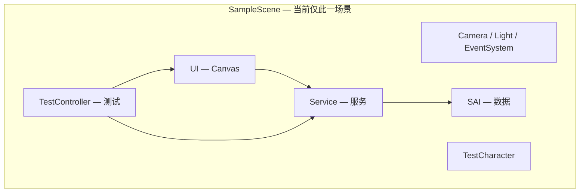

# 《墨渊行者》· 场景与 UI 功能架构

> 基于 **当前 Unity 工程实际状态** 编写（`SampleScene.unity`，**单场景、未做跨场景持久化**）。  
> 本文回答：Hierarchy 里有什么、Canvas 下有什么面板、各物体挂什么脚本、Inspector 拖什么。  
> 脚本文件放哪 → [[脚本结构]]；怎么用 → [[系统使用手册]]。

---

## §1 工程现状（请先读这段）

| 项                      | 当前状态                                     |
| ---------------------- | ---------------------------------------- |
| 工程路径                   | `Unity Store and Backpack System`        |
| 验收场景                   | `Assets/Scenes/SampleScene.unity`        |
| 部署模式                   | **所有物体在一个场景里**（服务 + UI + 测试）             |
| 跨场景 / DDOL / Bootstrap | **尚未实施**（将来另立企划，本文 §9 仅作备忘）              |
| 一键接线                   | `MoYuan → Setup Full Store Loop (A+B+C)` |



**依赖方向**（与代码一致）：`UI → Services → ItemDatabase / SO 配置`

### §1.1 交互现状（2026-05，优先于下文旧描述）

> 若下文 §2–§6 仍出现 **QuickSwitch / Tab / ShopContextMenu / 悬停购买 / rarityText**，以本节与 [[01_AI速读_商店背包]] 为准。

| 场景 | 当前交互 |
|---|---|
| 商店 | **左键点商品** → 固定位置 `ItemTooltipUI` + 栏内 **Buy**（缺货/缺钱仍显示按钮与原因） |
| 背包 | **左键点物品** → 点击位置弹出信息栏（**固定不跟鼠标**）+ Equip / Use |
| 开关 | 子工程 **B** / **I**（`Test/ItemTestController`）；**无 Tab、无 QuickSwitch** |
| 已移除 | `ShopContextMenuUI`（右键购买）、UI 根级 duplicate Tooltip |

信息栏结构：`InfoBody`（Scroll）+ 底部独立 `ActionButton`；**不显示稀有度**。

---

## §2 场景物体总结构

本节包含三部分：**最终要建成的目标树**（验收标准）、**与现状差异**、**当前场景快照**。

### 2.1 分组原则

| 根级分组 | 职责 | 可否挂 UI |
|---|---|---|
| **Engine** | 相机、光照、EventSystem | EventSystem 无 Canvas 也行 |
| **Data** | 运行时数据容器（背包实例、查表） | 否 |
| **Services** | 业务服务（买/卖/装/存档） | 否 |
| **Character** | 角色属性数据源（测试 stub） | 否 |
| **UI** | 唯一 Canvas，其下全部面板 | 是 |
| **Debug** | 测试按钮、快捷键（正式关卡删除） | 是 |

**依赖**：`UI → Services → Data`；同组内物体**平铺**，不再套多余空层。

---

### 2.2 最终目标 Hierarchy（SampleScene 验收标准）

> **单场景阶段**的完整设计树。物体名、脚本、默认 Active 以此为准；Setup 菜单按此生成/接线。

```
SampleScene
│
├─── 【Engine】────────────────────────────────────────────
├── Main Camera                          Camera, AudioListener
├── Directional Light                    Light
├── EventSystem                          EventSystem, StandaloneInputModule
│
├─── 【Data】──────────────────────────────────────────────
├── Data                                 （空 Transform，仅分组）
│   ├── ItemDatabase                     ItemDatabase.cs
│   └── Inventory                        Inventory.cs
│       └── Inspector: database → ItemDatabase
│
├─── 【Services】──────────────────────────────────────────
├── Services                             （空 Transform，仅分组）
│   ├── WalletService                    WalletService.cs
│   ├── ShopService                      ShopService.cs
│   │   └── Inspector: wallet, inventory, defaultTable
│   ├── EquipmentService                 EquipmentService.cs
│   │   └── Inspector: inventory, database, runeSlotCount=3
│   └── StoreSaveService                 StoreSaveService.cs
│       └── Inspector: inventory, wallet, equipment, shop, testCharacter
│
├─── 【Character】───────────────────────────────────────────
├── TestCharacter                        TestCharacter.cs
│
├─── 【UI】Canvas 根物体必须叫 UI ─────────────────────────
└── UI                                   Canvas, CanvasScaler, GraphicRaycaster
    │
    ├── ShopPanel                        ShopUI, Image          【Active: Off】
    │   ├── ShopItemView                 ScrollRect
    │   │   ├── Viewport                 Mask, Image
    │   │   │   └── Content              GridLayoutGroup      ← ShopUI.content
    │   │   └── Scrollbar Vertical       Scrollbar
    │   │       └── Sliding Area / Handle
    │   ├── InkHeader                    TextMeshProUGUI      ← ShopUI.inkText
    │   ├── CloseButton                  Button, Image        ← ShopUI.closeButton
    │   ├── BuyTabButton                 Button               ← ShopUI.buyTabButton
    │   │   └── Label                    TextMeshProUGUI
    │   ├── SellTabButton                Button               ← ShopUI.sellTabButton
    │   │   └── Label                    TextMeshProUGUI
    │   ├── ItemTooltipPanel             ItemTooltipUI, CanvasGroup, Image
    │   │   └── Body                     VerticalLayoutGroup + 各字段 TMP
    │   └── ShopContextMenu              ShopContextMenuUI
    │       └── Panel                      Image
    │           └── BuyButton              Button
    │               └── Label              TextMeshProUGUI
    │
    ├── InventoryPanel                   InventoryUI, Image     【Active: Off】
    │   ├── InventoryItemView              ScrollRect
    │   │   ├── Viewport                   Mask, Image
    │   │   │   └── Content                GridLayoutGroup      ← InventoryUI.content
    │   │   └── Scrollbar Vertical
    │   ├── CharacterStatsPanel            VerticalLayoutGroup
    │   │   ├── StatLine_Attack            AttributeStatLineUI  ← statLines[0]
    │   │   ├── StatLine_MaxHp             AttributeStatLineUI
    │   │   ├── StatLine_Defense           AttributeStatLineUI
    │   │   ├── StatLine_Speed             AttributeStatLineUI
    │   │   └── StatLine_CritRate          AttributeStatLineUI
    │   ├── RuneSlotsPanel                 HorizontalLayoutGroup
    │   │   ├── RuneSlot_0                 EquipmentSlotUI, Button, Image
    │   │   │   ├── Icon                   Image
    │   │   │   └── EmptyFrame             Image
    │   │   ├── RuneSlot_1                 EquipmentSlotUI  (slotIndex=1)
    │   │   └── RuneSlot_2                 EquipmentSlotUI  (slotIndex=2)
    │   ├── UseButton                      Button             ← InventoryUI.useButton
    │   │   └── Label                      TextMeshProUGUI
    │   └── CloseButton                    Button             ← InventoryUI.closeButton
    │
    ├── StoreInventoryPanelController      StoreInventoryPanelController.cs
    │   └── Inspector: shopUI, shopService, inventoryUI, quickSwitchButton/Label
    │
    └── QuickSwitchButton                  Button, Image
        └── Label                          TextMeshProUGUI
│
├─── 【Debug】正式关卡删除整组 ─────────────────────────────
└── Debug                                （空 Transform，仅分组）
    └── TestController                     ItemTestController.cs
        ├── ExternalQueryButton            Button → ExtQuery
        │   └── Label                      TextMeshProUGUI
        └── SaveRoundTripButton            Button → SaveTest
            └── Label                      TextMeshProUGUI
```

#### 目标树要点

| 项 | 规定 |
|---|---|
| Canvas 根名 | 必须 `UI` |
| 面板默认 | ShopPanel、InventoryPanel 均为 **Off**，由 PanelController / B/I 打开 |
| Tooltip / 信息栏 | 商店：**固定位置** ItemTooltip（ShopPanel 内）；背包：**点击弹出**（InventoryPanel 内或独立实例） |
| 已废弃 | `ShopContextMenu`、`QuickSwitchButton`、UI 根级 duplicate Tooltip |
| 动态列表格 | 运行时生成，不在场景里预先摆：ShopItem / SellItem / InventoryItem **Prefab** |
| 禁止出现 | `SAI/Shop`、UI 根下 `ItemTooltipPanel`、空容器 `AttributeText` |
| CharacterStatsPanel | 5 条 StatLine 用 `AttributeText.prefab` 实例，不用额外空父级 |

#### 根级物体数量（目标：11 个顶层 + Debug 可选）

| # | 顶层物体 | 脚本（业务） |
|---|---|---|
| 1 | Main Camera | — |
| 2 | Directional Light | — |
| 3 | EventSystem | 内置 |
| 4 | Data | —（分组） |
| 5 | Services | —（分组） |
| 6 | TestCharacter | TestCharacter |
| 7 | UI | Canvas 三组件 |
| 8 | Debug | —（分组，可选） |

---

### 2.3 现状 vs 目标（需清理项）

| 项目 | 当前场景 | 目标 |
|---|---|---|
| 数据分组名 | `SAI` | `Data` |
| 服务分组名 | `Service` | `Services` |
| 遗留物体 | `SAI/Shop`（Missing Script） | **删除** |
| UI 根 duplicate | `ItemTooltipPanel`、`ShopContextMenuPanel` | **删除**（ShopPanel 内已有） |
| InventoryPanel 子级 | 有多余 `AttributeText` 空容器 | **删除** |
| ShopPanel Active | Off | ✓ |
| InventoryPanel Active | On | 改为 **Off** |
| TestController 位置 | 场景根下 | 建议收进 `Debug/` 分组 |

**一键对齐目标**：`MoYuan → Setup Full Store Loop (A+B+C)` → Save Scene。

---

### 2.4 当前场景快照（2026-05 自 YAML 解析）

> 以下为**改造前**真实树，便于对照；以 §2.2 为目标验收。

```
SampleScene
├── Main Camera
├── Directional Light
├── EventSystem
├── SAI
│   ├── Shop                             ⚠ Missing Script
│   ├── Inventory                        Inventory.cs
│   └── ItemDatabase                     ItemDatabase.cs
├── Service
│   ├── WalletService / ShopService / EquipmentService / StoreSaveService
├── TestCharacter
├── TestController
│   ├── ExternalQueryButton / SaveRoundTripButton
└── UI
    ├── ShopPanel                        ShopUI  【Off】
    ├── InventoryPanel                   InventoryUI  【On】
    ├── ItemTooltipPanel                 ⚠ duplicate
    ├── ShopContextMenuPanel             ⚠ duplicate
    ├── StoreInventoryPanelController
    └── QuickSwitchButton
```

（ShopPanel / InventoryPanel **内部**子树与 §2.2 一致，详见 §4、§5。）

---

## §3 UI Canvas（物体名 `UI`）

### 3.1 根物体 `UI` 组件

| 组件 | 设置要点 |
|---|---|
| `Canvas` | Screen Space - Overlay |
| `CanvasScaler` | Scale With Screen Size（参考 800×600） |
| `GraphicRaycaster` | 必须，否则 Tooltip / 右键无效 |

**不在 `UI` 根上挂业务脚本。**

### 3.2 `UI` 下应有且仅需这些直接子物体

| 子物体 | 脚本 | 默认显示 | 说明 |
|---|---|---|---|
| ShopPanel | `ShopUI` + `Image` | Off | 商店 Buy / Sell |
| InventoryPanel | `InventoryUI` + `Image` | Off（建议） | 背包 / 符文 / Use |
| StoreInventoryPanelController | `StoreInventoryPanelController` | — | 互斥开关；**无 QuickSwitch** |

~~QuickSwitchButton、Tab 快速切换已移除。~~

**不应出现在 UI 根下**（当前场景有，应删）：

- `ItemTooltipPanel`（根级）→ 正确位置在 **ShopPanel 内**
- `ShopContextMenuPanel`（根级）→ 正确位置在 **ShopPanel 内**

清理：菜单 **MoYuan → Cleanup Legacy Scene Objects** 或 **Setup Full Store Loop**。

---

## §4 ShopPanel 内部结构（实际 + 规范）

```
ShopPanel                              ShopUI, Image, CanvasRenderer
├── ShopItemView                       ScrollRect
│   ├── Viewport                       Mask, Image
│   │   └── Content                    GridLayoutGroup     ← ShopUI.content
│   └── Scrollbar Vertical             Scrollbar
│       └── Sliding Area
│           └── Handle                   Image
├── CloseButton                        Button, Image
├── LnkText                            TextMeshProUGUI（装饰/链接文案）
├── InkHeader                          TextMeshProUGUI     ← ShopUI.inkText
├── ItemTooltipPanel                   ItemTooltipUI, CanvasGroup, Image
│   └── Body                           （子 TMP：name / rarity / price / …）
├── ShopContextMenu                    ShopContextMenuUI
│   └── Panel                          Image
│       └── BuyButton                  Button
│           └── Label                  TextMeshProUGUI
├── BuyTabButton                       Button
│   └── Label
└── SellTabButton                      Button
    └── Label
```

### 4.1 ShopUI — Inspector 引用（Setup 自动拖）

| 字段 | 指向 |
|---|---|
| shopService | `Service/ShopService` |
| wallet | `Service/WalletService` |
| inventory | `SAI/Inventory` |
| itemPrefab | `Assets/prefab/ShopItem.prefab` |
| sellItemPrefab | `Assets/prefab/SellItem.prefab` |
| content | `ShopItemView/Viewport/Content` |
| inkText | `InkHeader` |
| tooltip | **`ShopPanel/ItemTooltipPanel`**（固定信息栏，点商品弹出 + Buy） |
| buyTabButton / sellTabButton | Buy/Sell 模式切换（非 QuickSwitch） |
| closeButton | `CloseButton` |

~~contextMenu（ShopContextMenu）已废弃，方案为删除脚本。~~

### 4.2 ItemTooltipUI — 商店固定 / 背包点击

| 字段 | 说明 |
|---|---|
| panel | 自身 RectTransform |
| rootCanvas | `UI` 上的 Canvas |
| canvasGroup | 同物体 CanvasGroup |
| followMouse | 商店 **false**（固定）；背包 **false**（点击位置固定） |
| nameText, descriptionText, … | InfoBody（Scroll）内 TMP；**无 rarityText** |
| actionButton | 底部 Buy / Equip / Use |

~~§4.3 ShopContextMenuUI 已废弃。~~

### 4.4 动态格子 Prefab：`Assets/prefab/ShopItem.prefab`

| 根物体组件 | 子物体 |
|---|---|
| `ShopItemUI`, Image（Raycast ✓） | Icon (Image), PriceText (TMP), StockText (TMP) |

Buy Tab 运行时由 `ShopUI` 在 Content 下 Instantiate。

### 4.5 Sell Tab 动态格子：`Assets/prefab/SellItem.prefab`

| 根物体 | 组件 |
|---|---|
| SellItemUI | iconImage, countText, priceText, sellButton |

---

## §5 InventoryPanel 内部结构（实际 + 规范）

```
InventoryPanel                         InventoryUI, Image
├── InventoryItemView                  ScrollRect
│   ├── Viewport                       Mask, Image
│   │   └── Content                    GridLayoutGroup   ← InventoryUI.content
│   └── Scrollbar Vertical
├── CloseButton                        Button
├── AttributeText                      ⚠ 早期空容器，可删（属性已在 CharacterStatsPanel）
├── CharacterStatsPanel                VerticalLayoutGroup
│   ├── StatLine_Attack                AttributeStatLineUI（AttributeText.prefab）
│   ├── StatLine_MaxHp
│   ├── StatLine_Defense
│   ├── StatLine_Speed
│   └── StatLine_CritRate
├── RuneSlotsPanel                     HorizontalLayoutGroup
│   ├── RuneSlot_0                     EquipmentSlotUI, Button, Image
│   │   ├── Icon                       Image
│   │   └── EmptyFrame                 Image
│   ├── RuneSlot_1                     slotIndex = 1
│   └── RuneSlot_2                     slotIndex = 2
└── UseButton                          Button
    └── Label                          TextMeshProUGUI
```

### 5.1 InventoryUI — Inspector 引用（当前场景已接好）

| 字段 | 指向 |
|---|---|
| inventory | `SAI/Inventory` |
| database | `SAI/ItemDatabase` |
| testCharacter | `TestCharacter` |
| equipmentService | `Service/EquipmentService` |
| itemPrefab | `Assets/prefab/InventoryItem.prefab` |
| content | `InventoryItemView/Viewport/Content` |
| statLines[5] | CharacterStatsPanel 下 StatLine_* |
| runeSlots[3] | RuneSlot_0..2 |
| useButton | `UseButton` |
| closeButton | `CloseButton` |

### 5.2 AttributeStatLineUI — Prefab `AttributeText.prefab`

| 字段 | 说明 |
|---|---|
| statType | Attack / MaxHp / Defense / Speed / CritRate |
| valueText | 子物体 TMP |

### 5.3 EquipmentSlotUI — 每个 RuneSlot_*

| 字段 | 指向 |
|---|---|
| slotIndex | 0 / 1 / 2 |
| icon | Icon |
| emptyFrame | EmptyFrame |
| button | 槽根 Button |

### 5.4 动态格子 Prefab：`Assets/prefab/InventoryItem.prefab`

| 根物体 | 字段 |
|---|---|
| InventoryItemUI | iconImage, countText, backgroundImage（选中高亮） |

---

## §6 UI 公共控制

### 6.1 StoreInventoryPanelController（UI 根下）

| 字段 | 指向 |
|---|---|
| shopUI | ShopPanel |
| shopService | ShopService |
| inventoryUI | InventoryPanel |

**行为**：商店与背包不能同时开；关商店时调用 `ShopService.Close()` 归档限购。

~~§6.2 QuickSwitchButton / Tab 已移除。~~

### 6.2 TestController — 测试入口（非 UI 子物体）

| 字段 | 指向 |
|---|---|
| panelController | StoreInventoryPanelController |
| inventory / equipmentService / storeSaveService | 各 Service |
| wallet / testCharacter | 可选 Debug |
| externalQueryButton / saveRoundTripButton | 子按钮 |

| 按键 | 作用 |
|---|---|
| B | 开关商店 |
| I | 开关背包 |

~~Tab 快速切换已移除。~~

正式关卡可删除整个 `TestController` 分组；改由 NPC / 菜单调 `PanelController.OpenShop()` 等。

---

## §7 非 UI 场景物体 — 脚本与引用

### 7.1 SAI（数据）

| GameObject | 脚本 | Inspector |
|---|---|---|
| Inventory | `Inventory` | database → ItemDatabase |
| ItemDatabase | `ItemDatabase` | definitions：全部 Item SO 列表 |

### 7.2 Service（服务）

| GameObject | 脚本 | Inspector 关键字段 |
|---|---|---|
| WalletService | `WalletService` | 初始 Ink |
| ShopService | `ShopService` | wallet, inventory, **defaultTable** (ShopTableSO) |
| EquipmentService | `EquipmentService` | inventory, database, runeSlotCount=3 |
| StoreSaveService | `StoreSaveService` | inventory, wallet, equipment, shop, testCharacter |

### 7.3 TestCharacter

| 脚本 | 说明 |
|---|---|
| `TestCharacter` | 5 项基础属性 stub；背包 UI 属性区读这里（不含装备加成） |

### 7.4 EventSystem

UI 交互必须；与 `UI` 上 `GraphicRaycaster` 配合。

---

## §8 Prefab 与资产一览

| 路径 | 挂载脚本 | 用途 |
|---|---|---|
| `Assets/prefab/ShopItem.prefab` | ShopItemUI | 商店 Buy 列表格 |
| `Assets/prefab/SellItem.prefab` | SellItemUI | 商店 Sell 列表格 |
| `Assets/prefab/InventoryItem.prefab` | InventoryItemUI | 背包列表格 |
| `Assets/prefab/AttributeText.prefab` | AttributeStatLineUI | 属性行模板 |

物品 / 商店 **配置** 为 ScriptableObject（`Create → MoYuan/...`），不进 Hierarchy。

---

## §9 已知问题与清理（当前场景）

| 问题 | 处理 |
|---|---|
| `SAI/Shop` Missing Script | 删物体；或跑 Cleanup / Full Setup |
| UI 根下 duplicate Tooltip / ContextMenu | 删；ShopUI 只用 ShopPanel 内那套 |
| `InventoryPanel/AttributeText` 空容器 | 可删（已有 CharacterStatsPanel） |
| InventoryPanel 默认开着 | 建议改 Off |

**推荐操作**：打开 SampleScene → **MoYuan → Setup Full Store Loop (A+B+C)** → **Ctrl+S**。

---

## §10 自检清单（接主工程 / 验收前）

- [ ] Canvas 根名为 `UI`，含 Canvas + Scaler + Raycaster
- [ ] ShopPanel / InventoryPanel 挂 **ShopUI / InventoryUI**（不是误挂旧脚本）
- [ ] 无 UI 根级 duplicate Tooltip / ContextMenu
- [ ] 无 `SAI/Shop` 遗留
- [ ] PanelController、ShopUI、InventoryUI 引用已拖满
- [ ] Play：B/I、买卖、符文、Use、ExtQuery、SaveTest 通过

---

## §11 附录：将来多场景（**未实施，非本文范围**）

回合制需要地图 ↔ 战斗切场景时，**再单独立项**，大致方向：

- 把 §7 的 SAI + Service + TestCharacter 抽成 **Bootstrap Prefab + DontDestroyOnLoad**
- 各地图 / 战斗场景只放 **§3–§6 的 UI**（战斗或精简道具栏）
- 存档仍用现有 `StoreSaveService` JSON 块对接主存档

**当前阶段只做 SampleScene 单场景验收即可**；持久化方案待你叫执行时再写企划。

---

## §12 相关文档

| 文档 | 内容 |
|---|---|
| **本文** | 场景 Hierarchy + UI 树 + 挂脚本 |
| [[脚本结构]] | C# 文件目录 |
| [[系统使用手册]] | 策划 / 测试操作 |
| [[系统功能与工程规范]] | 行为约束 |
| 工程 `Assets/Script/StoreAndInventory/README.md` | 脚本索引 |
