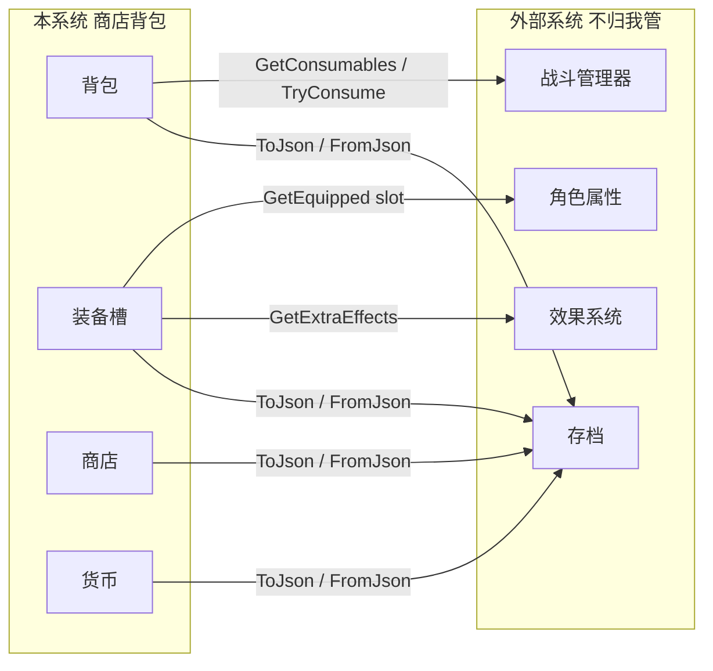
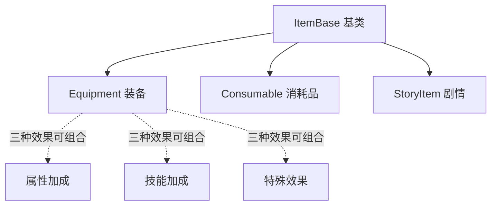
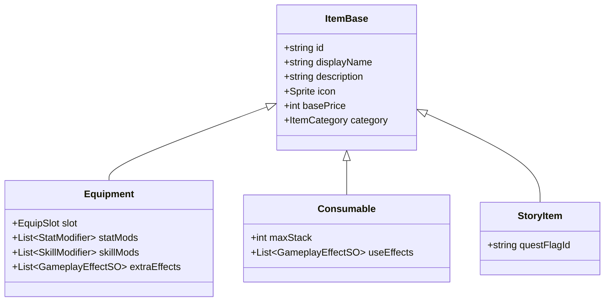
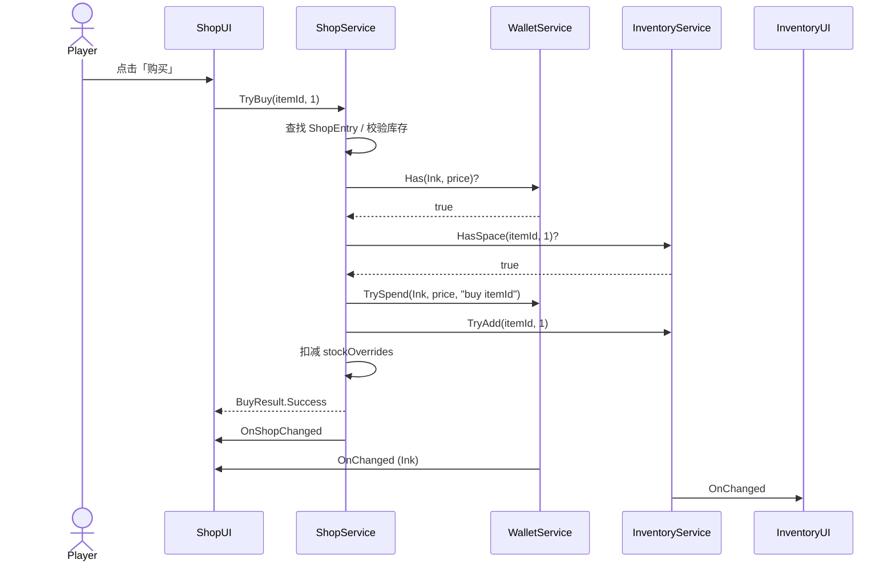

# 商店背包系统企划（v2）

> [!note] 设计背景文档
> 本文是早期设计源；**与当前实现有 drift**（如 5 类物品 vs 实现 3 类）。  
> **验收与行为以 [[系统功能与工程规范]] 为准**。

---

## §1 范围与边界

### 1.1 本系统**做什么**

| 域    | 内容                                       |
| ---- | ---------------------------------------- |
| 物品定义 | 5 类物品的数据结构（消耗 / 属性装备 / 技能装备 / 特效装备 / 剧情） |
| 背包   | 增删查、堆叠、容量、分类筛选                           |
| 商店   | 货架配置、买卖流程、刷新（接口级）                        |
| 装备槽  | 三槽记录「装了哪件」的状态，**不计算属性**                  |
| 货币   | 单币种「墨币」，结构支持多币种扩展                        |
| UI   | 上述五项对应的最小 UI                             |
| 测试入口 | 在独立工程内验证以上功能                             |

### 1.2 本系统**不做什么**

| 域 | 谁负责 |
|---|---|
| 装备属性如何影响角色面板 | 角色属性系统 |
| 装备技能加成如何作用于技能 | 战斗/技能系统 |
| 装备的特殊效果如何发动（攻击吸血、每回合护盾等） | 战斗/效果系统 |
| 消耗品使用时实际产生的战斗效果 | 战斗管理器 |
| 存档的实际读写 | 存档系统 |
| 面具切换联动装备 | 面具系统 |

### 1.3 对外**只提供接口、不实现**



接口契约见 [§6](#§6-对外接口契约)。

### 1.4 关键限制（贯穿全文）

| 限制 | 含义 |
|---|---|
| **L1** 装备特殊效果不实现 | 数据字段**预留**；效果脚本**留空 SO**；UI **只展示文本**；接口**提供查询** |
| **L2** 不接战斗/属性系统 | 所有跨系统调用走「§6 接口」，本系统不主动调用任何外部模块 |
| **L3** 不写存档读写 | 数据块**必须可序列化**，但本系统不调用 `File.Write` |

---

## §2 核心概念词典

### 2.1 名词

| 名词 | 含义 | 实例 |
|---|---|---|
| **物品（Item）** | 游戏内一切可被持有的东西 | 朱砂符、名刀、剧情钥匙 |
| **物品定义（ItemSO）** | 物品的策划配置，`ScriptableObject` 资产 | `equip_ming_dao.asset` |
| **物品实例（ItemStack）** | 容器里的「一格」，引用一个定义 | 背包第 0 格：`{equip_ming_dao, count=1, guid=a1b2}` |
| **容器（Container）** | 装物品的对象 | 背包、商店货架、装备槽 |
| **背包（Inventory）** | 玩家随身仓库 | 60 格 |
| **商店（Shop）** | NPC / 自助点的货架 | 云洲杂货铺 |
| **装备槽（EquipmentSlot）** | 角色身上的穿戴位 | 武器 / 护符 / 饰品 |
| **货币（Currency）** | 可累积的抽象资源 | 墨币 |
| **货币钱包（Wallet）** | 玩家持有的货币总量 | `{ink: 1240}` |

### 2.2 关键二分

| 二分 | 区别 |
|---|---|
| **定义 vs 实例** | 定义是 SO 资产，**全局只有一份**；实例是运行时数据，**每个玩家持有的副本** |
| **可堆叠 vs 独立** | 同 id 合并到一格 vs 每件独占一格 |
| **背包内 vs 装备中** | 装备穿上后**从背包移除**，进装备实例缓存 |
| **固定货架 vs 随机货架** | 商店每次开启稳定显示 vs 按权重抽样 |

### 2.3 数据流（一句话）

```
ItemSO（策划配） → ItemDatabase（启动索引） → ItemStack（运行时格子） → 容器（背包/商店/装备）
```

---

## §3 物品分类（核心讨论）

### 3.1 一级分类（3 大类）

按**玩家如何与之交互**分：

| 一级分类 `ItemCategory` | 交互方式 | 典型物品 |
|---|---|---|
| `Equipment` | 穿戴 / 卸下（被动） | 名刀、护符 |
| `Consumable` | 主动使用，扣数量 | 朱砂符（回血）、雷电符（释放技能） |
| `StoryItem` | 仅携带，不可装、不可使用 | 任务钥匙 |

[[一些特别的使用方法]] 第 4 条列出 5 类，其中 3 类装备子类型属于「装备」的二级展开（见 §3.2）。



### 3.2 装备的「3 种效果」表达方案（重点讨论）

[[一些特别的使用方法]] 第 4 条把装备分为「增基础属性 / 增技能属性 / 特殊效果」。问题是：**一件装备能不能同时具备多种效果？** 比如「名刀」既 +12 攻击（基础属性），又「暴击不衰减」（特殊效果）。

#### 方案对比

| 方案 | 数据结构 | 一件装备能否混合多类效果 | 配置复杂度 | 扩展性 |
|---|---|---|---|---|
| **A：1 类装备 + 3 列表** | `Equipment` 同时含 `statMods` / `skillMods` / `extraEffects` 三个列表 | **可以** | 中（一个 Inspector 三个折叠区） | 高 |
| **B：3 个互斥子类** | `AttributeEquipment` / `SkillEquipment` / `EffectEquipment` 三个独立 SO | **不可以**，一件装备只能挑一类 | 低 | 低（混合装备要新建第四类） |
| **C：本期只做 2 类** | 只做属性装备 + 技能装备，**特效装备完全不引入** | 暂不支持特效 | 低 | 低（以后加特效要重构 SO） |

#### 方案 A 详图（推荐）



**推荐方案 A**，理由：

1. 与 [[物品]] v2 已有设计一致，无需推翻
2. 一件「名刀」可以 `statMods=[Atk+12]` + `extraEffects=[暴击不衰减]`，符合 ARPG/Roguelike 直觉
3. 三个列表都为空时，装备退化为「纯外观装备」，自然支持
4. 战斗系统未来按通道（属性/技能/特效）分别消费，互不干扰

**不推荐 B**：策划做混合装备时，要么强行三选一（失真），要么造一堆「复合子类」（爆类）。  
**不推荐 C**：以后加特效装备时，已有装备 SO 都要重新走一遍，且老存档可能携带不存在的字段引用。

### 3.3 「特殊效果暂不实现」的具体语义（L1）

**为防止误解**，列清楚每一层做什么：

| 层 | 本期做法 |
|---|---|
| **数据字段** | 在 `Equipment` 上**保留** `extraEffects: List<GameplayEffectSO>` |
| **效果配置** | `GameplayEffectSO` **建空 SO 类**，仅含 `effectId` / `effectTag` / `displayNameKey` / `descriptionKey` 等纯描述字段，**不含逻辑** |
| **效果执行** | **不写**任何 `OnHit / OnTurnStart / Apply` 之类的方法 |
| **UI 展示** | Tooltip / 详情面板**展示文本**（如「暴击伤害不衰减」），不触发逻辑 |
| **对外接口** | **暴露查询方法** `EquipmentService.GetExtraEffects()`，返回当前装备所有 `GameplayEffectSO` 引用 |

战斗/效果系统未来接入时：

- 从接口拿到 `List<GameplayEffectSO>`
- 按 `effectId` 在自己侧注册逻辑（`if effectId == "crit_no_falloff" → ...`）
- 本系统不需要任何改动

**消耗品同理**：`Consumable.useEffects` 也只是 `GameplayEffectSO` 引用列表，不内置「回血 +30」之类的实际逻辑。

---

## §4 数据结构（详细字段表）

> 字段表 + csharp 伪代码 + 用途说明。命名空间统一 `StoreAndInventory.Data`。

### 4.1 `ItemBase`（基类，抽象）

| 字段 | 类型 | 默认 | 说明 |
|---|---|---|---|
| `id` | `string` | — | 全局唯一，**创建后禁改**；存档、网络、查询都认它 |
| `displayName` | `string` | — | 显示名（本地化 Key 或直显） |
| `description` | `string` | — | 多行描述 |
| `icon` | `Sprite` | — | 图标 |
| `category` | `ItemCategory` | — | 一级分类，子类自动固定 |
| `rarity` | `ItemRarity` | `Common` | 稀有度（仅影响 UI 染色） |
| `basePrice` | `int` | `0` | 商店参考价；`0` 表示不可购买 |
| `canSell` | `bool` | `true` | 是否允许玩家卖出 |
| `maxStack` | `int` | `1` | `1` 不可堆叠；`>1` 可堆叠 |

```csharp
public enum ItemCategory { Equipment, Consumable, StoryItem }
public enum ItemRarity { Common, Rare, Epic, Legendary }

public abstract class ItemBase : ScriptableObject
{
    public string id;
    public string displayName;
    [TextArea] public string description;
    public Sprite icon;
    public ItemRarity rarity;
    public int basePrice;
    public bool canSell = true;
    public int maxStack = 1;

    public abstract ItemCategory Category { get; }
    public virtual bool CanDiscard => true;
}
```

**抽象**：禁止直接创建 `ItemBase` 资产，必须用子类。

### 4.2 `Equipment`（装备，方案 A）

| 字段 | 类型 | 说明 |
|---|---|---|
| `slot` | `EquipSlot` | 武器 / 护符 / 饰品 |
| `statMods` | `List<StatModifier>` | ① 基础属性加成 |
| `skillMods` | `List<SkillModifier>` | ② 技能/卡牌加成 |
| `extraEffects` | `List<GameplayEffectSO>` | ③ 特殊效果（本期不发动） |

```csharp
public enum EquipSlot { Weapon, Talisman, Accessory }

[CreateAssetMenu(menuName = "MoYuan/Item/Equipment")]
public class Equipment : ItemBase
{
    public EquipSlot slot;
    public List<StatModifier> statMods = new();
    public List<SkillModifier> skillMods = new();
    public List<GameplayEffectSO> extraEffects = new();

    public override ItemCategory Category => ItemCategory.Equipment;
}
```

**固定**：装备一律 `maxStack = 1`（即使 SO 里能填，逻辑层强制覆盖）。

#### 4.2.1 `StatModifier`（属性加成数据）

| 字段 | 类型 | 说明 |
|---|---|---|
| `stat` | `StatType` | 攻击 / 生命 / 防御 / 速度 / 暴击率 / ... |
| `flat` | `float` | 加法值（+12） |
| `percent` | `float` | 乘法值（+0.1 = +10%） |

> 角色属性系统未来负责「flat + percent」如何叠加；本系统只存数据。

#### 4.2.2 `SkillModifier`（技能加成数据）

| 字段 | 类型 | 说明 |
|---|---|---|
| `targetKind` | `SkillModTarget` | 按 `skillId` / `cardId` / `skillTag` 匹配 |
| `targetId` | `string` | 目标技能/卡牌的 id |
| `modType` | `SkillModType` | 数量增加 / 范围扩大 / 伤害加成 / 冷却缩短 / ... |
| `value` | `float` | 数值 |

#### 4.2.3 `GameplayEffectSO`（特殊效果，本期为空壳）

```csharp
[CreateAssetMenu(menuName = "MoYuan/Effect/Gameplay")]
public class GameplayEffectSO : ScriptableObject
{
    public string effectId;       // 全局唯一
    public string effectTag;      // 去重/分组 tag（如 crit_no_falloff）
    public string displayNameKey;
    [TextArea] public string descriptionKey;
}
```

**留接口位**：未来加 `trigger`（OnHit/OnTurnStart）、`duration` 等字段时，本期已有装备资产不需要重做。

### 4.3 `Consumable`（消耗品）

| 字段 | 类型 | 说明 |
|---|---|---|
| `maxStack`（继承） | `int` | 默认 99 |
| `useEffects` | `List<GameplayEffectSO>` | 使用时挂哪些效果（本期不执行） |
| `consumeOnUse` | `int` | 单次使用消耗几个（默认 1） |
| `useContext` | `UseContext` | 仅探索 / 仅战斗 / 任意 |

```csharp
public enum UseContext { Exploration, Battle, Any }

[CreateAssetMenu(menuName = "MoYuan/Item/Consumable")]
public class Consumable : ItemBase
{
    public List<GameplayEffectSO> useEffects = new();
    public int consumeOnUse = 1;
    public UseContext useContext = UseContext.Any;

    public override ItemCategory Category => ItemCategory.Consumable;
}
```

### 4.4 `StoryItem`（剧情）

| 字段 | 类型 | 说明 |
|---|---|---|
| `questFlagId` | `string` | 持有即满足某剧情条件（任务系统读取） |
| `canDiscard`（重写） | `bool` | 通常 `false` |

```csharp
[CreateAssetMenu(menuName = "MoYuan/Item/Story")]
public class StoryItem : ItemBase
{
    public string questFlagId;

    public override ItemCategory Category => ItemCategory.StoryItem;
    public override bool CanDiscard => false;
}
```

### 4.5 `ItemStack`（运行时一格）

| 字段 | 类型 | 说明 |
|---|---|---|
| `definitionId` | `string` | 对应 `ItemBase.id` |
| `count` | `int` | 数量；不可堆叠物固定为 `1` |
| `instanceGuid` | `string?` | 独立实例时的随机 id（如装备） |

```csharp
[Serializable]
public class ItemStack
{
    public string definitionId;
    public int count;
    public string instanceGuid; // null/empty 表示纯堆叠

    public bool IsEmpty => string.IsNullOrEmpty(definitionId) || count <= 0;
}
```

**为什么不直接存 `ItemBase` 引用？** 存档不可序列化 SO 引用；id 索引可跨工程、跨版本。

### 4.6 `InventoryData`（背包运行时）

| 字段 | 类型 | 说明 |
|---|---|---|
| `capacity` | `int` | 容量（默认 60） |
| `slots` | `List<ItemStack>` | 每件物品占一格；空格不保留 |

```csharp
[Serializable]
public class InventoryData
{
    public int capacity = 60;
    public List<ItemStack> slots = new();
}
```

### 4.7 `EquipmentData`（装备槽运行时）

| 字段 | 类型 | 说明 |
|---|---|---|
| `weaponInstanceGuid` | `string?` | 当前武器实例 guid |
| `talismanInstanceGuid` | `string?` | 当前护符 |
| `accessoryInstanceGuid` | `string?` | 当前饰品 |

```csharp
[Serializable]
public class EquipmentData
{
    public string weaponInstanceGuid;
    public string talismanInstanceGuid;
    public string accessoryInstanceGuid;
}
```

**离包缓存**（不进 EquipmentData，独立维护）：`Dictionary<guid, ItemStack>`，存储当前所有「已装备」的实例。装备时从背包移除并存入此缓存；卸下时反向。

### 4.8 `CurrencyWallet`（货币钱包）

| 字段 | 类型 | 说明 |
|---|---|---|
| `balances` | `Dictionary<CurrencyId, int>` | 多币种存储 |
| `caps` | `Dictionary<CurrencyId, int>` | 各币种上限（`0` 表示无限） |

```csharp
public enum CurrencyId { Ink, Spirit /* 预留 */ }

[Serializable]
public class CurrencyWallet
{
    public List<CurrencyEntry> entries = new();
    // 用 List 代替 Dictionary 以便 JsonUtility 序列化
}

[Serializable]
public class CurrencyEntry
{
    public CurrencyId id;
    public int amount;
    public int cap; // 0 = 无上限
}
```

**本期**：UI 只显示 `Ink`；逻辑允许 `Spirit` 存在但不出现在 UI。

### 4.9 `ShopTableSO`（商店配置）

| 字段 | 类型 | 说明 |
|---|---|---|
| `shopId` | `string` | 全局唯一 |
| `displayName` | `string` | 商店名 |
| `fixedStock` | `List<ShopEntry>` | 固定货架 |
| `randomPool` | `List<ShopEntry>` | 随机池（按权重抽样） |
| `randomSlotCount` | `int` | 每次随机出几个 |
| `priceMultiplier` | `float` | 全店价格系数（预留，本期不参与计算） |
| `refreshCostCurrency` | `int` | 手动刷新花费（预留，本期 UI 不暴露） |

```csharp
[CreateAssetMenu(menuName = "MoYuan/Shop/Table")]
public class ShopTableSO : ScriptableObject
{
    public string shopId;
    public string displayName;
    public List<ShopEntry> fixedStock = new();
    public List<ShopEntry> randomPool = new();
    public int randomSlotCount = 3;
    public float priceMultiplier = 1f;
    public int refreshCostCurrency = 0;
}

[Serializable]
public class ShopEntry
{
    public ItemBase item;         // 编辑器拖引用
    public int priceOverride;     // <=0 用 item.basePrice
    public int stock;             // -1 无限 / 正整数限购
    [Range(0, 1)] public float weight = 1f; // 随机池权重
}
```

### 4.10 `ShopRuntimeData`（运行时商店状态）

| 字段 | 类型 | 说明 |
|---|---|---|
| `shopId` | `string` | 对应 `ShopTableSO.shopId` |
| `stockOverrides` | `List<StockEntry>` | 当前剩余库存（限购物） |
| `randomSnapshot` | `List<string>` | 当前随机出的物品 id 快照 |
| `lastRefreshTick` | `long` | 上次刷新时间戳（可选） |

```csharp
[Serializable]
public class ShopRuntimeData
{
    public string shopId;
    public List<StockEntry> stockOverrides = new();
    public List<string> randomSnapshot = new();
    public long lastRefreshTick;
}

[Serializable]
public class StockEntry
{
    public string itemId;
    public int remaining;
}
```

**为什么分离 SO 和 Runtime？** SO 是策划配置不可写，玩家行为（买掉一件、刷新）必须落到 Runtime。

---

## §5 逻辑模块（职责 + 关键 API）

> 命名空间 `StoreAndInventory.Core`。本节给的是**接口签名**，不是实现。

### 5.1 `ItemDatabase`

**职责**：启动时扫所有 `ItemBase` 资产 → 建 `id → ItemBase` 字典。

```csharp
public class ItemDatabase
{
    public void Build(IEnumerable<ItemBase> definitions);
    public bool TryGet(string id, out ItemBase item);
    public IEnumerable<ItemBase> All { get; }
    public int Count { get; }
}
```

**约束**：重复 id 报 `LogError`；查不到的 id 不静默创建空物品。

### 5.2 `InventoryService`

**职责**：背包的增删查、堆叠、容量、消耗品使用。

```csharp
public class InventoryService
{
    public InventoryData Data { get; }

    // 增
    public bool TryAdd(string itemId, int count, out string message, out string newInstanceGuid);
    public void AddStack(ItemStack stack); // 内部用（装备卸下回包）

    // 删
    public bool TryRemoveAt(int slotIndex, int count, out string message);
    public ItemStack RemoveStackByGuid(string instanceGuid);

    // 查
    public int GetCount(string itemId);
    public bool HasSpace(string itemId, int count);
    public int FindFirstIndex(string itemId);

    // 使用消耗品（仅扣数量，不执行效果）
    public bool TryConsume(int slotIndex, UseContext context, out List<GameplayEffectSO> effects, out string message);

    // 事件
    public event Action OnChanged;
    public event Action<string, int> OnItemAdded;
    public event Action<string, int> OnItemRemoved;
}
```

**关键约定**：

- `TryAdd` 内部按 `maxStack` / `category` 决定走「合并到已有格」还是「新开格」
- `TryConsume` 返回**效果列表**给调用方（战斗管理器），本系统不执行
- 装备类调 `TryAdd` 时强制每件独立 guid，不堆叠

### 5.3 `EquipmentService`

**职责**：装/卸装备，仅维护「谁在哪个槽」，**不计算属性**。

```csharp
public class EquipmentService
{
    public EquipmentData Data { get; }

    // 装/卸
    public bool TryEquipFromBag(int bagSlotIndex, out string message);
    public bool TryUnequip(EquipSlot slot, out string message);

    // 查询（给角色属性系统、战斗系统）
    public ItemStack GetEquippedStack(EquipSlot slot);
    public Equipment GetEquippedItem(EquipSlot slot);
    public IReadOnlyList<StatModifier> GetAllStatMods();
    public IReadOnlyList<SkillModifier> GetAllSkillMods();
    public IReadOnlyList<GameplayEffectSO> GetAllExtraEffects();

    // 事件
    public event Action<EquipSlot, ItemStack> OnEquipped;
    public event Action<EquipSlot, ItemStack> OnUnequipped;
}
```

**关键约定**：

- 装备时：背包对应格被移除 → 实例存入离包缓存 → 槽 guid 写入 `EquipmentData`
- 卸下时：反向；若背包满则装失败（也可改为「拒绝卸下」或「掉地上」，本期选**拒绝卸下**）
- 同槽换装：旧件先卸（必须背包有位），再装新件

### 5.4 `ShopService`

**职责**：商店打开/关闭、买卖、刷新。

```csharp
public class ShopService
{
    public ShopTableSO CurrentShop { get; }
    public ShopRuntimeData CurrentRuntime { get; }

    // 生命周期
    public void Open(ShopTableSO table);
    public void Close();

    // 交易
    public BuyResult TryBuy(string itemId, int count);
    public SellResult TrySell(int bagSlotIndex, int count);

    // 刷新（本期只做接口）
    public void Refresh(bool payCost);

    // 事件
    public event Action<ShopTableSO> OnShopOpened;
    public event Action OnShopClosed;
    public event Action OnShopChanged;
}

public enum BuyResult { Success, NoCurrency, NoSpace, OutOfStock, InvalidItem }
public enum SellResult { Success, NotSellable, InvalidSlot }
```

**关键约定**：

- 买卖依赖 `InventoryService` + `WalletService`，三方协作（见 §5.6 时序图）
- `TryBuy` 流程：找到 `ShopEntry` → 校验库存 → 校验货币 → 校验背包容量 → 扣货币 + 加物品 + 扣库存 → 触发事件
- `TrySell` 流程：从背包取出 → 校验 `canSell` → 加货币 → 触发事件；本期不入"回购"队列

### 5.5 `WalletService`

**职责**：货币加减、上限。

```csharp
public class WalletService
{
    public CurrencyWallet Data { get; }

    public int Get(CurrencyId id);
    public bool Has(CurrencyId id, int amount);
    public void Add(CurrencyId id, int amount, string reason = null);
    public bool TrySpend(CurrencyId id, int amount, string reason = null);

    public event Action<CurrencyId, int> OnChanged;
}
```

**关键约定**：

- `Add` / `TrySpend` 都打 Debug.Log（带 `reason`），便于排查
- 达到 `cap` 时多余溢出，溢出量记入日志

### 5.6 模块协作：购买流程时序图



---

## §6 对外接口契约

> 呼应 [[一些特别的使用方法]] 1–6 条：本节是「我提供什么、不提供什么」的合同。**本期不实现外部系统**，只验证签名能跑。

### 6.1 给角色属性系统

**用途**：[[一些特别的使用方法]] 1：角色属性要获取装备栏装备的属性。

```csharp
// 角色属性系统这样调用：
foreach (var slot in Enum.GetValues<EquipSlot>())
{
    var equipment = equipmentService.GetEquippedItem(slot);
    if (equipment == null) continue;
    foreach (var mod in equipment.statMods)
        characterStats.Apply(mod);
}
// 或一次拿完
var allMods = equipmentService.GetAllStatMods();
```

**约定**：

- 返回的是 SO 引用，**只读**；属性系统不得修改
- 装/卸时角色属性系统应订阅 `OnEquipped` / `OnUnequipped` 重算

### 6.2 给战斗效果阶段

**用途**：[[一些特别的使用方法]] 2：战斗效果处理阶段要施展装备的特殊效果。

```csharp
var effects = equipmentService.GetAllExtraEffects();
foreach (var fx in effects)
{
    if (fx.effectTag == "crit_no_falloff") { /* 战斗系统自己实现 */ }
    if (fx.effectTag == "lifesteal") { /* ... */ }
}
```

**约定**：

- 本系统**只返回数据**，不做任何 `Apply`
- `effectTag` 是双方约定的字符串契约
- 同一 `effectTag` 多件装备同时具备时，**本系统不去重**（战斗系统按业务规则决定）

### 6.3 给战斗管理器

**用途**：[[一些特别的使用方法]] 3：战斗管理器要能读取/消耗背包内消耗品。

```csharp
// 列出可用消耗品（按战斗上下文过滤）
var usable = inventoryService.Data.slots
    .Where(s => itemDatabase.TryGet(s.definitionId, out var d) && d is Consumable c && c.useContext != UseContext.Exploration)
    .ToList();

// 使用
if (inventoryService.TryConsume(slotIndex, UseContext.Battle, out var effects, out var msg))
{
    foreach (var fx in effects) battleEffectSystem.Apply(fx, target);
}
```

**约定**：

- `TryConsume` 只负责扣数量，返回效果列表给战斗管理器执行
- 战斗管理器决定**何时**能使用（"精准防御窗口"等），本系统不做约束

### 6.4 给存档系统

**用途**：[[一些特别的使用方法]] 6：资产不存档，背包/商店持有物品要存档。

| 数据块 | 存档键 | 内容 |
|---|---|---|
| `inv.v1` | 背包 | `InventoryData` |
| `equip.v1` | 装备槽 | `EquipmentData` + 离包缓存（List 形式） |
| `wallet.v1` | 货币 | `CurrencyWallet` |
| `shop.<shopId>.v1` | 商店运行时 | `ShopRuntimeData`，每个商店一份 |

```csharp
public interface ISaveBlock
{
    string Key { get; }
    int Version { get; }
    string ToJson();
    bool FromJson(string json);
}
```

**约定**：

- 所有数据结构必须可被 `JsonUtility.ToJson` 序列化（不用 `Dictionary`，用 `List<KVPair>`）
- 缺失字段走默认值；多余字段忽略
- 版本号变化时由存档系统迁移，本系统提供 `MigrateFrom(int oldVersion, string json)` 钩子（可选）

---

## §7 商店细化

### 7.1 单商店 vs 多商店

- **数据层**：支持多个 `ShopTableSO` 资产（每个商店一份配置 + 一份 `ShopRuntimeData`）
- **运行时**：通常同时只开**一个**商店（玩家不能同时和两个 NPC 交易）
- **多商店共存的支撑**：`ShopService.Open(table)` 切换当前商店；`ShopRuntimeData` 按 `shopId` 分别保存

### 7.2 货架结构

| 类型 | 来源 | 玩家可见 |
|---|---|---|
| 固定货架 | `fixedStock` 全部列出 | 永远显示（除非售罄） |
| 随机货架 | 从 `randomPool` 按 `weight` 抽 `randomSlotCount` 个 | 刷新前不变 |

**抽样规则**：

- 同一物品在随机池中不重复抽中
- 抽样发生在 `Open` 时（若 `randomSnapshot` 为空）或 `Refresh` 时

### 7.3 价格规则

```
最终单价 = (priceOverride > 0 ? priceOverride : item.basePrice) * shop.priceMultiplier
```

- `priceMultiplier` 字段保留但**本期固定 `1.0`**
- 卖出价 = 最终买入价 × 卖出系数（系数全局可配，本期硬编码 `0.5`）

### 7.4 限购

| `stock` 值 | 行为 |
|---|---|
| `-1` | 无限购买 |
| `0` | 不可购买（售罄） |
| `>0` | 限购，按 `stockOverrides` 记录剩余 |

### 7.5 买卖流程（参考 §5.6 时序图）

**买**：库存 → 货币 → 容量 → 扣货币 + 加物品 + 扣库存 → 事件  
**卖**：找格 → `canSell` → 加货币 + 移除物品 → 事件

### 7.6 本期**不做**

| 项 | 留什么 |
|---|---|
| 回购（卖出物 6 件原价买回） | 不留 |
| 手动刷新（玩家花钱重抽随机货架） | `refreshCostCurrency` 字段保留，UI 不暴露 |
| 自动刷新（休息点 / 剧情节点） | `Refresh` 方法保留，调用方先不接 |
| 声望折扣 | `priceMultiplier` 字段保留，固定 1.0 |

---

## §8 背包细化

### 8.1 容量

- 默认 `60` 格
- 容量由 `InventoryData.capacity` 控制，运行时可被「背包扩容」类道具修改（本期不做扩容道具）

### 8.2 堆叠规则

| 类别 | 行为 |
|---|---|
| `Equipment` | **强制每件独立 guid**，一件一格 |
| `Consumable` | 按 `maxStack` 合并；满则新开格 |
| `StoryItem` | 不堆叠（一格一件） |

### 8.3 装备离包


- 穿上：背包格删 → 缓存写入 → 槽 guid 写入
- 卸下：背包加格 → 缓存删 → 槽 guid 清空
- 背包满时卸下：**拒绝操作**，返回 `message="背包已满"`

### 8.4 分类筛选

- 数据层**不分桶**：所有物品都在同一个 `slots` 列表
- UI 层用 `ItemBase.Category` 过滤显示
- 排序由 UI 层负责（按稀有度 / 获取时间 / 类型）

### 8.5 丢弃规则

| 类别 | 可否丢弃 |
|---|---|
| `Equipment` | 可丢（先卸下后丢） |
| `Consumable` | 可丢 |
| `StoryItem` | **不可丢**（`CanDiscard=false`） |
| `rarity == Legendary` | 本期不限，未来可加二次确认 |

### 8.6 容量未满 vs 已满的添加行为

| 情况 | 行为 |
|---|---|
| 已有同 id 未满格 + 可堆叠 | 优先合并 |
| 无同 id 格 / 已满 / 不可堆叠 | 占用新格 |
| 无新格 | `TryAdd` 返回 `false`，`message="背包已满"` |

---

## §9 UI 范围

> 命名空间 `StoreAndInventory.UI`。本节列**做哪些**，每个 UI 给「输入 / 输出 / 不做」。

### 9.1 `InventoryUI`

| 项 | 说明 |
|---|---|
| 输入 | `InventoryService` 引用 |
| 显示 | 网格列出所有 `slots`；顶部分类 Tab（全部 / 装备 / 消耗 / 剧情） |
| 操作 | 点击格子选中；按钮触发使用 / 装备 / 丢弃 |
| 输出 | 调用 `InventoryService` / `EquipmentService` 对应方法 |
| 不做 | Tooltip 悬浮、拖拽、动画、多选 |

### 9.2 `InventoryItemUI`

| 项 | 说明 |
|---|---|
| 输入 | `ItemStack` + 对应 `ItemBase` |
| 显示 | 图标 / 名字 / 数量（堆叠时） |
| 操作 | 点击触发选中事件 |
| 不做 | Tooltip 详情 |

### 9.3 `ShopUI`（已实现基本骨架）

| 项 | 说明 |
|---|---|
| 输入 | `ShopService` + `WalletService` 引用 |
| 显示 | 货架列表 + 玩家当前货币 + 关闭按钮 |
| 操作 | 按钮：购买 / 卖出（切 Tab） / 关闭 |
| 输出 | `ShopService.TryBuy / TrySell` |
| 已实现 | 货架显示、关闭按钮、B 键开关 |
| 待加 | 货币显示、卖出 Tab、购买按钮 |

### 9.4 `ShopItemUI`（已实现基本骨架）

| 项 | 说明 |
|---|---|
| 输入 | `ItemBase` + 价格 + 库存 |
| 显示 | 图标 / 名字 / 价格 / 库存 |
| 操作 | 购买按钮 |
| 已实现 | 图标 / 价格 |
| 待加 | 名字 / 库存 / 购买按钮 |

### 9.5 `EquipmentSlotUI`

| 项 | 说明 |
|---|---|
| 输入 | `EquipmentService` + 槽位 |
| 显示 | 三个槽的当前装备图标 + 槽名 |
| 操作 | 点击槽 → 卸下 |
| 不做 | 拖入装备（用背包 → 装备按钮代替） |

### 9.6 `WalletUI`

| 项 | 说明 |
|---|---|
| 输入 | `WalletService` 引用 |
| 显示 | 一行：`墨币 1234` |
| 订阅 | `WalletService.OnChanged` 自动刷新 |

### 9.7 **不做**

- 飘字（"+1 朱砂符"）
- Tooltip 悬浮详情
- 入场 / 退场动画
- 音效
- 红点系统
- 快速栏（QuickSlot）
- 操作焦点保留
- 稀有度边框染色（本期统一色）

---

## §10 测试入口

详见 [[测试项]]。本系统的最小测试用例：

```
1. ItemTestController 加几个装备 / 消耗品 / 剧情资产
2. 按按钮 / 快捷键：
   - 给玩家加 1 件装备 + 5 个消耗品
   - 打开商店（按 B）
   - 买 1 件装备（验证：货币扣 / 背包加 / 库存减）
   - 装备这件装备（验证：背包减 / 装备槽显示 / GetAllStatMods 返回正确）
   - 使用消耗品（验证：背包数量 -1 / TryConsume 返回 effects 列表）
   - 卖回 1 件（验证：货币加 / 背包减）
3. 关掉游戏，重开（验证：存档块能正确还原）
```

---

## §11 里程碑

| 阶段 | 包含章节 | 内容 | 验收 |
|---|---|---|---|
| **M1** 数据骨架 | §4 全部 | `ItemBase` / `Equipment` / `Consumable` / `StoryItem` / `ItemStack` / `InventoryData` / `EquipmentData` / `CurrencyWallet` / `ShopTableSO` / `ShopRuntimeData` | 编辑器能 `Create` 全部资产；`ItemDatabase` 启动建索引无错 |
| **M2** 服务层 | §5 全部 | `ItemDatabase` / `InventoryService` / `EquipmentService` / `ShopService` / `WalletService` | EditMode 单测：增删查 / 装卸 / 买卖 / 货币 |
| **M3** UI | §9.1–§9.6 | `InventoryUI` / `ShopUI`（升级）/ `EquipmentSlotUI` / `WalletUI` | Play 模式完整跑「拿物品 → 买卖 → 装备 → 使用消耗品」 |
| **M4** 对外接口 | §6 全部 | 写 stub 调用方验证签名能跑通 | 假装是「角色属性系统」从外部跑通查装备 |
| **M5** 打磨 | §8.5 / 9.x | 丢弃确认、背包满提示、错误飘字 | — |

**优先级**：M1 → M2 → M3 → M4 → M5；M4 不阻塞 M3，可并行。

---

## §12 风险与待决

| # | 议题 | 当前建议 | 决策方 |
|---|---|---|---|
| Q1 | 装备分类用方案 A / B / C？ | **A**（1 类 + 3 列表） | 已在 §3.2 拍板 |
| Q2 | 货币单 vs 多币种？ | 数据结构留多币种位、UI 只显示「墨币」 | 待拍板 |
| Q3 | 背包满时卸装备怎么办？ | **拒绝卸下**，UI 提示 | 已建议 |
| Q4 | 战斗中能否换装？ | **不允许**（避免破坏 build 策略） | 待战斗企划同步 |
| Q5 | 同 `effectTag` 装备叠加怎么处理？ | **本系统不去重**，交战斗系统判断 | 已建议 |
| Q6 | 消耗品在「精准防御窗口」能否使用？ | 本系统不约束，交战斗系统 | 已建议 |
| Q7 | 商店刷新机制（休息点 / 手动） | **本期不做**，留 `Refresh` 接口 | 已建议 |
| Q8 | 装备强化 / 词缀 | **本期不做**；以后挂在 `instanceGuid` 对应的扩展表 | 已建议 |
| Q9 | 多面具切换是否带不同装备套装 | **本期单套**；以后 `EquipmentData` 改为 `Dictionary<MaskId, EquipmentData>` | 待面具企划同步 |
| Q10 | 「特殊效果暂不实现」是否会卡 M4 验收？ | 不会，`extraEffects` 只返回引用，调用方自决 | 已澄清 |

---

## §13 命名与路径约定

### 13.1 id 命名

- 全部小写蛇形（snake_case）
- 前缀按一级分类：
  - 装备：`equip_<name>`（`equip_ming_dao`）
  - 消耗品：`cons_<name>`（`cons_zhusha_fu`）
  - 剧情：`story_<name>`（`story_yan_lu_key`）
- 商店：`shop_<location>_<index>`（`shop_yunzhou_01`）
- 效果：`effect_<tag>`（`effect_crit_no_falloff`）

### 13.2 SO 资源路径

```
Assets/GameData/Items/
├── Equipment/equip_xxx.asset
├── Consumable/cons_xxx.asset
└── Story/story_xxx.asset

Assets/GameData/Effects/effect_xxx.asset
Assets/GameData/Shops/shop_xxx.asset
```

### 13.3 代码命名空间

| 层 | 命名空间 | 内容 |
|---|---|---|
| 数据 | `StoreAndInventory.Data` | SO 类 + 运行时结构体 |
| 逻辑 | `StoreAndInventory.Core` | 五个 Service + `ItemDatabase` |
| UI | `StoreAndInventory.UI` | 所有 UI 组件 |
| 测试 | `StoreAndInventory.Test` | `ItemTestController` 等（不迁主工程） |

### 13.4 事件命名

- 容器变更：`OnChanged`
- 具体动作：`OnItemAdded` / `OnItemRemoved` / `OnEquipped` / `OnUnequipped` / `OnShopOpened` / `OnShopChanged`
- 命名规律：`On<Subject><Verb>`

### 13.5 存档键

| 键 | 内容 |
|---|---|
| `inv.v1` | `InventoryData` |
| `equip.v1` | `EquipmentData` + 离包缓存 |
| `wallet.v1` | `CurrencyWallet` |
| `shop.<shopId>.v1` | `ShopRuntimeData` 每商店一份 |

---

## 附录 A：与老版差异说明

本文是 [[商店背包系统]] 的 v2 重写。与老版（374 行，2025 草案）差异：

| 维度 | 老版 | v2 |
|---|---|---|
| 范围 | 含战斗、面具、UX 细节、本地化等 | **只**做本系统职责；外部走接口 |
| 物品分类 | `Consumable / Rune / Material / KeyItem` 四类 | `Equipment / Consumable / StoryItem` 三类，Equipment 含 3 子效果 |
| 装备名 | `RuneSO`（符文） | `Equipment`（代码层，世界观仍可叫"符文"） |
| 装备效果 | 三列表写死在 SO | 三列表 + **特殊效果本期只留字段不实现** |
| 商店 | 含回购、刷新、声望折扣 | **保留字段、不实现**；只做基础买卖 |
| UI/UX | 含 Tooltip、飘字、音效、红点 | 全砍，留最小 UI |
| 存档 | 含版本号迁移机制 | 留 `ToJson/FromJson` 接口；版本机制由存档系统负责 |

老版可作为「未来扩展时」的参考库，但不再是设计源。

---

## 附录 B：术语速查

| 缩写 / 术语 | 全称 |
|---|---|
| SO | `ScriptableObject`（Unity 可序列化配置资产） |
| id | 物品定义全局唯一标识 |
| guid | 物品实例随机标识（装备等独立物使用） |
| slot | 槽位（装备槽 / 背包格） |
| stack | 一格物品（含 id + count + guid） |
| `extraEffects` | 装备的特殊效果列表（本期仅数据，不发动） |
| `effectTag` | 效果分组标识，跨装备同 tag 由战斗系统决定如何处理 |
