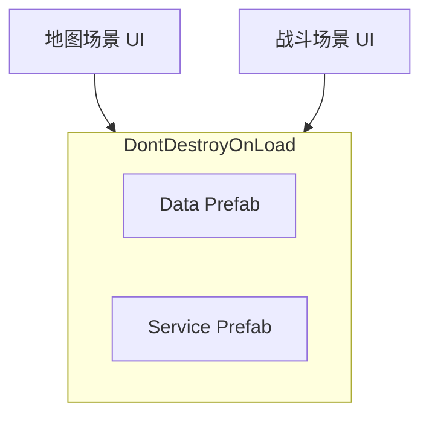

# 背包系统跨场景持久化

> **C5 参考文档**。当前子工程为单场景验收；接主工程且存在地图 ↔ 战斗切换时再实施。

---

## §1 要解决的问题

| 需求 | 说明 |
|---|---|
| 数据不断 | 切场景后背包、货币、装备、商店限购仍在 |
| UI 可换 | 地图用完整 Shop/Inventory；战斗可只用精简栏或同一 Panel |
| 存档一致 | 仍用 `StoreSaveService` JSON 块，由主存档系统落盘 |

---

## §2 推荐架构（Bootstrap + DDOL）

1. **Bootstrap Prefab**（首场景或 Loading 场景实例化一次）  
   - 含：`ItemDatabase` 所在 Data、`Inventory` / `ShopService` / `WalletService` / `EquipmentService` / `StoreSaveService`  
   - `DontDestroyOnLoad` 挂在 Bootstrap 根物体  
2. **各玩法场景**只放 UI（或战斗专用 UI），`FindObjectOfType` 或主工程注入引用  
3. **TestCharacter** 换为主工程角色；或 Bootstrap 上挂主角色属性组件  

详见 [[UI结构]] §11。

---

## §3 与现有 API 的关系

| 已有能力 | 跨场景用法 |
|---|---|
| `StoreSaveService.CaptureAllJson` / `ApplyAllJson` | 切场景**不必**每次 Capture；**读档/存档**时与主存档合并 |
| 各 Service 单例 | DDOL 后全进程一份 runtime 数据 |
| `StoreInventoryPanelController` | 每场景 UI 各一份，或 HUD 全局一份（主工程定） |

---

## §4 实施 checklist（P2 / C5）

- [ ] 主工程定：哪些场景需要完整背包 UI
- [ ] Bootstrap Prefab + DDOL 策略与 GameManager 对齐
- [ ] 战斗场景是否禁用 ShopPanel
- [ ] 读档：`ApplyAllJson` 在 Bootstrap Awake 之后执行
- [ ] 验收：地图买物 → 进战斗 → 回地图，物品与 Ink 仍在

接线步骤见 [[02_接入主工程清单]]；公共 API 见 [[04_公共API与扩展点]]。
