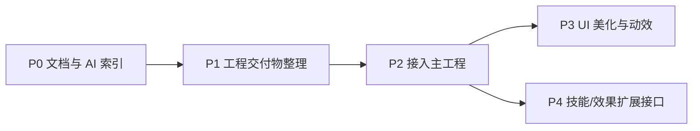

# 商店背包 · 整合与优化总方案（草案）

> 来源：[[最后的优化和处理]] + 现有执行文档 + 当前工程状态。  
> **本文是排期与决策框架，不是最终实施清单**——具体做哪些、做到哪一步，需与你逐轮确认后再动笔记/代码。

---

## §0 你的核心诉求（原文提炼）

| # | 诉求 | 解读 |
|---|---|---|
| 1 | **新 AI / 新环境能完整理解系统** | 文档 + 注释 + 入口索引，优先级最高 |
| 2 | 下一步可能是 **UI 美化** | 涉及 UI 代码，但功能已闭环，细节可后置 |
| 3 | **整合**：UI / 管理器 / 角色 | 从独立 SampleScene 迁入《墨渊行者》总工程 |
| 4 | 技能、效果等 **扩展** | 主项目负责执行；本系统只提供数据与查询 |
| 5 | 可能 **改动物品系统源码** | 需写清边界与破坏性变更提醒 |
| 6 | 传给主项目 **完整、自主** 的子系统 | 可拷贝/引用即用，少依赖测试脚手架 |

---

## §1 当前基线（2026-05-26）

### 1.1 功能状态

- **商店 / 背包 / 装备 / 货币 / 存档块 / 对外查询**：已在 `Unity Store and Backpack System` 验收闭环（见 [[系统功能与工程规范]] §5）。
- **UI 交互**：商店固定信息栏 + Buy；背包点击弹出信息栏 + Equip/Use；B/I 测试开关（非正式 HUD）。
- **已知未做 / 归主工程**：GameplayEffect **执行**、磁盘存档、跨场景 DDOL、正式地图商店入口、HUD 视觉统一。

### 1.2 文档现状

| 文档 | 角色 | 缺口 |
|---|---|---|
| [[系统功能与工程规范]] | 验收 + 行为约束 | 缺「接入主工程步骤」 |
| [[系统使用手册]] | 策划/程序使用 | 缺「给 AI 的 5 分钟速读」 |
| [[脚本结构]] + `README.md` | 代码地图 | 缺「改哪里会炸什么」清单 |
| [[工程清理与优化记录]] | 已做变更 | 未覆盖「接入前删什么」 |
| [[小小的各种优化建议]] | backlog | 部分条目已过时（交互已改） |

### 1.3 工程可优化点（待你确认是否做）

| 类别 | 观察 | 建议方向 |
|---|---|---|
| 冗余代码 | `ShopContextMenuUI` 仍保留但未接线；`Test/` 与 `TestCharacter` 耦合 | 接入前标记 Deprecated 或移入 `Samples/` |
| 注释 | Service 层有 XML 但不统一 | 仅补 **公共 API + 接入点** 注释，不全量重写 |
| 场景垃圾 | 历史重复 Controller / 多 ItemInfoPanel | Setup + Cleanup 已修；需 **接入检查清单** |
| 「大优化」 | 分层已清晰 | **不建议** 无需求重构；优先 **删测试依赖 + 文档** |

---

## §2 建议分阶段（默认顺序，可调）

### P0 · 文档与 AI 可理解性（你强调的第一优先级）

**目标**：陌生 AI 打开 Obsidian + Unity 文件夹，**不读全库代码**也能接活。

建议新增/改写（文件夹：`商店背包执行/整合与优化/`）：

| 文件 | 内容 |
|---|---|
| `01_AI速读_商店背包.md` | 5 分钟：边界、目录、3 条依赖规则、Setup 菜单、验收命令 |
| `02_接入主工程清单.md` | 拷贝哪些文件夹、删哪些 Test、Scene 接线、Bootstrap 选项 |
| `03_修改物品系统注意事项.md` | 改 Data/SO/id 规则/Observable 时的连锁反应 |
| `04_公共API与扩展点.md` | ShopService / Inventory / EquipmentService / StoreSaveService 对外方法表 |

**代码侧（轻量）**：

- 各 Service 顶部 3～5 行「职责 + 禁止做什么」
- `StoreAndInventory/README.md` 增加链接到 Obsidian 相对路径说明

**不做**：全文件逐行注释、大规模 rename。

---

### P1 · 工程交付物整理（「清除多余内容」）

**目标**：交给主项目的文件夹 = **运行时必需 + Editor Setup**，测试代码可选隔离。

| 动作 | 选项 A（保守） | 选项 B（激进） |
|---|---|---|
| `Test/` | 保留，文档标明「勿拷贝进主工程」 | 移到 `Samples/StoreInventoryDemo/` |
| `TestCharacter` | 保留 stub，主工程替换 | 抽 `ICharacterStatsProvider` 接口 |
| `ItemTestController` | 仅 Demo 场景 | 删除，主工程自写输入 |
| `ShopContextMenuUI` | 保留文件 + `[Obsolete]` | 删除 |
| SampleScene | 保留为 Demo | 仅保留最小 Demo 场景 |

**待你定**：选 A 还是 B，或混合。

---

### P2 · 接入主工程

**子项**（可并行，但顺序建议如下）：

1. **管理器整合**：`StoreInventoryPanelController`、各 Service 单例/DDOL 策略与主工程 GameManager 对齐
2. **角色整合**：`TestCharacter` → 主工程角色属性源；`EquipmentService.GetAllStatMods()` 供战斗读
3. **UI 整合**：Panel Prefab 迁入主 UI Canvas；B/I 改为 HUD 按钮或地图触发
4. **存档整合**：`StoreSaveService.Capture/Apply` 挂到主存档 JSON 节点

详见将写的 `02_接入主工程清单.md`（P0 产出）。

---

### P3 · UI 美化（功能完整后的增量）

- 信息栏字段增删、Scroll 高度、动效（DOTween 等）
- 背包分类 Tab、拖拽装备（见 [[小小的各种优化建议]] P1/P2）
- **与 P2 关系**：可先接入「丑但正确」的 UI，再换皮；或接入前在子工程换皮一次

---

### P4 · 技能 / 效果扩展

**原则**（与你原文一致）：

- 本系统：`GameplayEffectSO`、`skillMods`、`extraEffects` **只定义与聚合**
- 主项目：读取 `EquipmentService` / `InventoryQuery` 后 **执行** 技能修改与 Buff

需在 `04_公共API与扩展点.md` 写清：**哪些字段已被读、哪些尚未执行**（避免 AI 误以为 statMods 会改战斗数值）。

---

## §3 「修改物品系统源码」风险备忘（摘要）

| 改动 | 可能影响 |
|---|---|
| 改 `ItemBase.id` 规则 | 已有 SO 资产、存档 JSON、ShopTable 引用全部失效 |
| 改 `InventorySlot` 结构 | 存档块格式变；需版本号 |
| 在 Data 层加 `UnityEngine` 引用 | 破坏「Data 无 UGUI」分层 |
| 改 `EquipmentService` 槽位枚举 | UI 槽位绑定、存档 equip 块 |
| 删 `[Obsolete]` API | 若 Demo/Test 仍引用会编译失败 |

完整版 → `03_修改物品系统注意事项.md`（P0 产出）。

---

## §4 待你确认的问题（决策表）

> 下面每一项都会影响「写哪些笔记、改哪些代码」。请逐轮回答；答完一轮我会更新本文 **§5 已确认决策** 并开始执行对应 P 阶段。

| ID | 问题 | 选项 / 说明 |
|---|---|---|
| Q1 | **第一刀做什么？** | A 只做 P0 文档 · B P0+P1 整理工程 · C 直接 P2 接入 |
| Q2 | **交付形态？** | 整文件夹拷贝 · Git submodule · UPM 本地包 · 仅文档主工程自实现 |
| Q3 | **Test 代码怎么处理？** | 保留在子工程 · 移 Samples · 主工程零 Test 依赖 |
| Q4 | **UI 美化时机？** | 接入前 · 接入后 · 暂不做 |
| Q5 | **「大优化」力度？** | 仅清理+注释 · 中等（接口抽象 TestCharacter）· 大重构（不建议） |
| Q6 | **Obsidian 笔记结构？** | 新建 `整合与优化/` 文件夹（本方案）· 合并进现有手册 · 其他 |
| Q7 | **主工程 Unity 版本 / UI 框架？** | 版本号、UGUI / UI Toolkit、是否已有背包类系统 |

---

## §5 已确认决策（随问答更新）

| ID | 决策 | 日期 |
|---|---|---|
| Q1 | **先写方案笔记，确认后再执行**（非立即改代码） | 2026-05-26 |
| Q2 | 交付形态 = **整文件夹 + Prefab**（`StoreAndInventory` + `Assets/prefab/`） | 2026-05-26 |
| Q3 | **Test/ 保留在子工程**，主工程勿拷贝 | 2026-05-26 |
| Q4 | **UI 现状即完成**，本阶段不做 UI 美化/改动 | 2026-05-26 |
| Q5 | **先审计列清单**，逐项批准后再改代码 | 2026-05-26 |
| Q6 | P0 四份子文档 **并行撰写** | 2026-05-26 |
| Q7 | `ShopContextMenuUI` → **删除**（执行阶段） | 2026-05-26 |
| Q8 | `TestCharacter` → **仅文档**，不抽接口 | 2026-05-26 |
| Q9 | Prefab 策略 **B**（Data+Service Prefab，UI 合并主 Canvas） | 2026-05-26 |
| Q13 | **P1 已执行**（删 ContextMenu、Service 注释、README） | 2026-05-26 |
| Q11 | 步骤企划 **不打包** 给主工程；保留本地归档 | 2026-05-26 |
| Q12 | 文档整理 D1–D7 **已执行** | 2026-05-26 |

---

## §6 下一步（确认后执行）

1. 根据 §5 更新本方案 status → `已确认`
2. 按优先级撰写 P0 子文档（§2 表格）
3. 若选 P1：列出具体删除/移动文件清单 + 跑 Setup 验收
4. 同步修订 [[小小的各种优化建议]] 中已过时的交互描述
5. 主工程接入时开 `02_接入主工程清单.md` 逐项勾选

---

## 附录 · 相关文件速链

- 工程根：`d:\Unity\Unity Store and Backpack System\`
- 脚本：`Assets/Script/StoreAndInventory/`
- Setup 菜单：`MoYuan → Setup Full Store Loop (A+B+C)`
- 想法来源：[[最后的优化和处理]]
