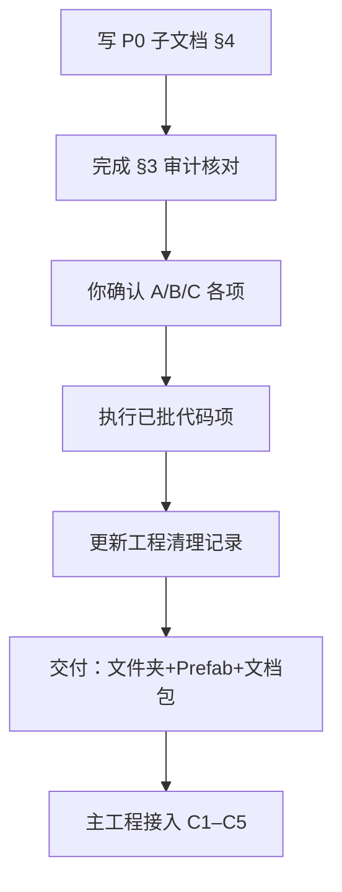

# 项目功能优化方案

> **定位**：在接入《墨渊行者》主工程之前，把子系统整理成「**完整、自主、可被新 AI 读懂**」的交付包。  
> **当前不做**：UI 美化、动效、信息栏字段微调——功能已验收，UI 迭代留到以后。  
> **执行原则**：先审计出清单 → 你点头 → 再改代码/笔记（不擅自大重构）。

---

## §1 已确认方向（2026-05-26 第一轮）

| 项 | 你的选择 |
|---|---|
| 节奏 | **先本方案 + 子文档写全，确认后再执行** |
| 交付物 | **整个 `StoreAndInventory` 脚本文件夹 + `Assets/prefab/` 下相关 Prefab** |
| Test/ | **保留在子工程**；主工程拷贝时 **不要带 `Test/`** |
| UI | **现状即完成态**，本阶段不改 UI 代码 |
| 代码优化 | **先审计列清单**，逐项确认后再动刀 |

---

## §2 交付包边界（给主工程 / 给 AI）

### 2.1 应拷贝

| 路径 | 内容 |
|---|---|
| `Assets/Script/StoreAndInventory/` | 运行时 + Editor（见 §2.2 排除项） |
| `Assets/prefab/` | `Data.prefab` · `Service.prefab` · `UI.prefab` · `InventoryItem` · `ShopItem` · `SellItem` · `AttributeText` |
| 物品/商店 SO 资产 | 按主工程目录规范另定（通常在 `Resources` 或 Addressables） |
| Obsidian | **`交付包/`** 整个文件夹 |

### 2.2 不要拷贝进主工程

| 路径 | 原因 |
|---|---|
| `StoreAndInventory/Test/` | 仅 SampleScene 调试用（B/I、`ItemTestController`） |
| `SampleScene.unity` | Demo 场景；主工程自建场景并跑 Setup 或手工接线 |
| `ShopContextMenuUI`（已删除） | 交互已改为信息栏内 Buy |

### 2.3 「完整、自主」的含义

- **完整**：买/卖/装/卸/消耗/限购/存档块/查询 API 均可独立运行，不依赖 Test 输入。
- **自主**：Service 层不引用主工程类型；主工程通过 **公共 API + Prefab 接线** 接入。
- **可被 AI 读懂**：Obsidian 有速读 + API 表 + 接入清单 + 改动物品系统风险说明（P0 文档，见 [[00_整合优化总方案]] §2 P0）。

---

## §3 代码审计清单（待你逐项确认是否执行）

> 状态：⬜ 未做 · 🔍 仅审计 · ✅ 已做 · ❌ 你否决

### 3.1 疑似冗余 / 遗留

| ID  | 项                             | 现状                   | 建议                       | 风险  | 状态       |
| --- | ----------------------------- | -------------------- | ------------------------ | --- | -------- |
| A1  | `ShopContextMenuUI.cs`        | 已删除               | —                        | 低   | ✅ 已执行 |
| A2  | `ItemTooltipUI.ShowAtMouse` 等 | 有 `[Obsolete]` 旧 API | 保留；迁移说明见系统使用手册           | 低   | ✅ 保留 |
| A3  | `Inventory` 遗留 API            | 第二轮已删 Obsolete API  | 无需再改                     | —   | ✅ 已清理 |
| A4  | 场景中重复 Controller              | Cleanup + 接入清单 §5     | 文档已写                     | 低   | ✅ 文档 |
| A5  | `SellItemUI`                  | ShopUI Sell 模式使用     | 非冗余，保留                   | —   | ✅ 保留 |

### 3.2 注释与 AI 可读性（轻量，不动逻辑）

| ID | 项 | 建议 | 状态 |
|---|---|---|---|
| B1 | 各 Service 类头 | 3～5 行：职责 / 谁调用 / 禁止做什么 | ✅ |
| B2 | `StoreSaveService` | 标明 Capture/Apply 与主存档对接示例 | ✅ |
| B3 | `EquipmentService` | 标明 statMods 仅聚合，**不执行** skillMods/extraEffects | ✅ |
| B4 | `README.md` | 增加「主工程接入 3 步」+ Obsidian 链接 | ✅ |
| B5 | 公共方法 XML | 类头已覆盖；逐方法 XML 延后 | ⬜ 延后 |

### 3.3 整合相关（接入主工程时做，本方案只写清单）

| ID | 项 | 说明 | 状态 |
|---|---|---|---|
| C1 | `TestCharacter` | **仅文档** | ✅ 文档 → [[02_接入主工程清单]] §3.3 |
| C2–C5 | 主工程接入 | P2 阶段 | ⬜ 接主工程时做 |

### 3.4 明确不做（除非你改口）

- UI 美化、动效、Tooltip 字段增删
- 背包拖拽 / 分类 Tab（见 [[小小的各种优化建议]]，P2 以后）
- GameplayEffect **执行器**（主项目技能系统负责）
- 无清单批准下的「总体大优化 / 分层重构」

---

## §4 文档优化方案（与代码并行，优先执行）

| 顺序 | 文档 | 目的 |
|---|---|---|
| 1 | `02_接入主工程清单.md` | 拷贝列表、Prefab、Setup、自检、常见坑 | ✅ 草案 |
| 2 | `01_AI速读_商店背包.md` | 新 AI 5 分钟上手 | ✅ 草案 |
| 3 | `03_修改物品系统注意事项.md` | 改 SO/id/存档 的连锁反应 | ✅ 草案 |
| 4 | `04_公共API与扩展点.md` | 方法表 + skillMods 边界 | ✅ 草案 |
| 5 | 修订 [[小小的各种优化建议]] | 交互描述与现状对齐（悬停/右键等过时条目） | ✅ 已加顶部提示 |

**文件夹索引**：[[README]]（交付包入口）

---

## §5 建议执行顺序（你确认方案后）

1. **阶段 A（现在）**：完善 Obsidian `整合与优化/` 子文档 ← **当前**
2. **阶段 B**：按 §3 表格逐项核对工程，更新「建议/状态」列
3. **阶段 C**：你勾选 A1–B5 哪些要改 → 我改代码 + 更新 [[工程清理与优化记录]]
4. **阶段 D**：主工程拷贝 + 按 `02_接入主工程清单` 接线

---

## §6 仍需你回答的问题（第二轮）

见下方对话中的结构化提问；答完后我会回写 [[00_整合优化总方案]] §5 并细化 §3 每一项的「做/不做」。

---

## §7 验收标准（本方案完成时）

- [x] 新 AI 只读 Obsidian `整合与优化/` + `系统功能与工程规范` 能说明系统边界与接入步骤
- [x] §3 审计表每项有明确结论（做 / 不做 / 延后）
- [x] 交付清单明确：**拷什么、不拷什么、Prefab 列表**
- [x] 主工程接入前 **零 Test 依赖** 可编译（Test 不拷贝即可）
- [x] UI 代码本阶段 **零改动**
