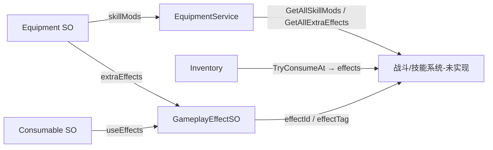

# 商店背包系统 · 使用手册

> 面向**使用 Unity 工程的人**（策划配表、程序接 API、测试验收）。  
> 功能细节与约束见 [[系统功能与工程规范]]；设计背景见 [[商店背包系统]]。

---

## §1 快速开始（5 分钟）

### 1.1 打开工程

路径：`Unity Store and Backpack System`  
场景：`Assets/Scenes/SampleScene.unity`

### 1.2 一次性接线（必做）

Unity 菜单依次执行（或只跑最后一项）：

```
MoYuan → Setup Full Store Loop (A+B+C)       // 推荐：A+B+C 全自动 + 清理遗留物体
MoYuan → Cleanup Legacy Scene Objects        // 仅删 SAI/Shop、Canvas 根 duplicate 面板
```

执行后 **Save Scene**（Ctrl+S）。

### 1.3 Play 模式操作

| 按键 / 按钮 | 作用 |
|---|---|
| **B** | 开/关商店（测试用；接入总工程后改由商店触发逻辑） |
| **I** | 开/关背包 |
| **ExtQuery** | 打印对外查询 API 快照（测试） |
| **SaveTest** | 存档回环自测（测试） |

> **商店与背包不能同时打开**；开一个会自动关另一个。

---

## §2 策划：配物品

### 2.1 创建物品

| 类型 | 菜单 |
|---|---|
| 符文（装备） | Create → MoYuan/Item/Equipment |
| 消耗品 | Create → MoYuan/Item/Consumable |
| 剧情物 | Create → MoYuan/Item/Story |

### 2.2 必填字段

| 字段 | 说明 |
|---|---|
| **idSuffix** | 只填后缀，如 `huoyan_fu`（不要手写完整 id） |
| **Name** | 显示名（英文，UI 字体限制） |
| **icon** | 图标 Sprite |
| **basePrice** | 基准买卖价（Ink） |
| **description** | Tooltip 描述 |

保存后 Inspector 会自动：

- 生成只读 **id**（如 `equip_huoyan_fu`）
- 重命名资产为 **`id_Name`**

### 2.3 id 命名规则

- 全小写蛇形：`a-z`、`0-9`、`_`
- **必须带前缀**（由子类自动加）：`equip_` / `cons_` / `story_`

### 2.4 各类型注意点

| 类型 | 要点 |
|---|---|
| **Equipment** | 每件独立一格；可配 `statMods` / `skillMods` / `extraEffects` |
| **Consumable** | 设 `maxStack`、`consumeOnUse`、`useContext`（Any / Exploration / Battle） |
| **StoryItem** | 默认 `canSell=false`；可填 `extraStoryText` |

### 2.5 注册到数据库

打开场景里 **ItemDatabase** 物体 → 把新物品 SO 拖进 **Definitions** 列表。

### 2.6 效果资产 `GameplayEffectSO`（Create → MoYuan/Effect/Gameplay）

用于**可复用的机制单元**，被装备 `extraEffects`、消耗品 `useEffects` 引用。  
**本期只有身份 + 展示字段，不含执行逻辑**；战斗/探索系统将来按 `effectId` 在自己侧实现。

| 字段 | 用途 | 谁消费 |
|---|---|---|
| **effectId** | 全局唯一 id（如 `heal_30`、`leidian_strike`） | 战斗执行器：`if (fx.effectId == "...")` |
| **effectTag** | 分组 / 去重 / 互斥（如 `crit_no_falloff`） | 战斗侧按 tag 批量处理或同类只生效一次 |
| **displayNameKey** | 展示名（本地化 key 或直接文案） | Tooltip / 信息栏 |
| **descriptionKey** | 效果说明 | Tooltip / 信息栏 |

**为什么要单独做成 SO（资产化）？**

1. **复用**：同一条效果可被多个物品引用（如 `heal_30` 既给朱砂符，也给某护符被动）。
2. **解耦**：背包系统只传 `List<GameplayEffectSO>` 引用，不引用战斗代码。
3. **策划配置**：Inspector 拖引用即可，不必改 C#。
4. **可扩展**：以后可在 SO 上加 `trigger`、`duration` 等，已有物品资产不用重做。

**配表示例**

```
effect_leidian.asset     effectId=leidian_strike
cons_leidian_fu          useEffects → [effect_leidian]
                         description → 玩家可读的技能/符箓说明（见 [[一些特别的使用方法]]）
```

### 2.7 技能相关：三种数据，别混用

| 概念 | 数据结构 | 管什么 | 本期是否执行 |
|---|---|---|---|
| **改已有技能数值** | `Equipment.skillMods`（`SkillModifier`） | 如火球 +1 颗、冷却 -10% | ❌ 只聚合，战斗系统读 `GetAllSkillMods()` |
| **被动 / 触发机制** | `Equipment.extraEffects` → `GameplayEffectSO` | 如暴击不衰减、攻击吸血 | ❌ 只查询，战斗读 `GetAllExtraEffects()` |
| **使用物品触发效果** | `Consumable.useEffects` → `GameplayEffectSO` | 如雷电符、回血符 | ❌ `TryConsumeAt` 只返回列表，不 Apply |
| **技能本体**（未实现） | 未来 `SkillDefinitionSO` 等 | 伤害、冷却、动画、投射物 | 在主工程战斗模块 |



**文案约定**（[[一些特别的使用方法]]）：

- **skillMods 类符文**（「火球 +1」）：玩家说明写在物品 **description**；结构化数值填 `skillMods`。
- **独立机制效果**（回血、放雷、被动）：定义在 **GameplayEffectSO**；物品 description 可写使用方式，执行仍认 `effectId`。

**程序接 API**

```csharp
var skillMods = equipmentService.GetAllSkillMods();   // List<SkillModifier>
var passives = equipmentService.GetAllExtraEffects(); // List<GameplayEffectSO>

inventory.TryConsumeAt(bagIndex, 1, UseContext.Battle, out var effects, out _);
// effects 为 GameplayEffectSO 列表，由战斗系统按 effectId 执行
```

设计边界见 [[商店背包系统]] §1.2：**装备技能如何作用于技能、特殊效果如何发动、消耗品实际效果 — 均由战斗/效果系统负责，本系统只提供查询接口。**

---

## §3 策划：配商店

### 3.1 创建商店表

Create → **MoYuan/Shop/Table**

| 字段 | 说明 |
|---|---|
| **idSuffix** | 如 `test_zahuopu` → 自动 `shopId = shop_test_zahuopu` |
| **displayName** | 商店显示名 |
| **fixedStock** | 固定货架（见下） |

### 3.2 货架一行（ShopEntry）

| 字段 | 说明 |
|---|---|
| item | 拖物品 SO |
| priceOverride | `>0` 覆盖价；`≤0` 用 `item.basePrice` |
| stock | **仅符文生效**：`-1` 无限，`>0` 限购 N 次，`0` 不卖 |

消耗品 / 剧情物：**忽略 stock**，有钱就能买。

### 3.3 绑定到场景

选中 **ShopService** → **Default Table** 拖入你的 ShopTableSO。

---

## §4 玩家向功能说明

### 4.1 商店（Buy Tab）

1. 打开商店（测试：B；接入总工程后由 NPC/交互等触发）
2. 看左上角 **Ink** 余额
3. **左键点击**商品 → 面板内固定 **ItemInfoPanel** 展示详情
4. 信息栏下方 **Buy** 购买
5. 点击面板外关闭信息栏；符文限购在信息栏 / 货架上显示剩余

### 4.2 商店（Sell Tab）

1. 点 **Sell** Tab
2. 列表为当前**背包内**物品（已装备的符文不会出现）
3. 点 **Sell** 卖 1 个 → 获得 `basePrice` Ink
4. `canSell=false` 的物品不可卖

### 4.3 背包

1. 打开背包（**I** 切换）
2. **左侧/顶部**：5 行角色基础属性（Attack、Max HP 等）
3. **符文槽**：3 个空槽 / 已装图标
4. **物品格**：图标 + 数量

| 操作 | 方法 |
|---|---|
| 选中符文槽 | 点击空槽 / 已装槽（空槽高亮，表示后续装备目标） |
| 装备符文 | 先选槽 → 点击背包符文 → 信息栏 **Equip** |
| 卸下符文 | 点击已装槽 → 信息栏 **Unequip** |
| 使用消耗品 | 点击消耗品 → 信息栏 **Use** |
| 关闭信息栏 | 点击面板外，或 Equip / Use / Unequip 成功后 |

> 属性区显示 **基础值 + 装备 statMods 加成**（如 `Attack: 15 (+5)`）。skillMods / extraEffects 不在此面板计算。

---

## §5 程序：场景必备物体

| GameObject | 组件 |
|---|---|
| ItemDatabase | 物品索引 |
| WalletService | 货币 |
| Inventory | 背包 |
| ShopService | 商店逻辑 |
| EquipmentService | 符文槽 |
| TestCharacter | 测试用基础属性 |
| StoreSaveService | 存档协调 |
| StoreInventoryPanelController | 商店/背包 **互斥**开关 |
| Canvas / ShopPanel | ShopUI |
| Canvas / InventoryPanel | InventoryUI |
| TestController | ItemTestController（`Test/`，**勿拷主工程**） |
| EventSystem | UI 交互必须 |

---

## §6 程序：对外 API 速查

### 6.1 装备加成（给属性系统）

```csharp
var statMods = equipmentService.GetAllStatMods();
var skillMods = equipmentService.GetAllSkillMods();
var effects = equipmentService.GetAllExtraEffects();
```

装/卸时订阅 `OnEquipped` / `OnUnequipped` 触发重算。

### 6.2 消耗品（给战斗）

```csharp
// 列出可用消耗品
var list = inventory.GetConsumables(UseContext.Battle);

// 按格使用
if (inventory.TryConsumeAt(bagIndex, count, UseContext.Battle, out var effects, out var msg))
{
    // 由战斗系统执行 effects（本系统不 Apply）
}
```

### 6.3 存档（给存档系统）

```csharp
// 导出
string json = storeSaveService.CaptureAllJson();

// 读档
storeSaveService.ApplyAllJson(json, out var error);

// 自测
storeSaveService.RoundTripSelfTest(out error);
```

存档块键名：`inv.v1`、`equip.v1`、`wallet.v1`、`character.v1`、`shop.{shopId}.v1`

---

## §7 测试验收清单

按 [[中企划A_商店闭环]] + [[中企划B_背包闭环]] + [[中企划C_收尾闭环]] 测，或简版：

- [ ] B/I 开/关商店/背包（互斥：开一个会关另一个）
- [ ] 左键点商品 Buy、Sell 卖、信息栏 Equip/Unequip/Use
- [ ] 信息栏固定位置、可 Scroll、点外关闭
- [ ] 限购符文买完后不能买；关店再开剩余数保持
- [ ] ExtQuery / SaveTest 通过（子工程）

---

## §8 常见问题

### Q：`Tooltip` 编译报错 CS0246？

`[Tooltip]` 是 Unity 的 `UnityEngine.TooltipAttribute`，只在挂了 `using UnityEngine;` 的脚本里能用。  
`Data/` 层纯数据类应**避免**用 `[Tooltip]`，改用注释；已修复 `InventoryData.cs`。

### Q：编译通过但 Play 没 UI？

没跑 Setup 菜单 → 执行 **Setup Full Store Loop** 并 Save Scene。

### Q：背包打开像商店 / 没物品格？

`InventoryPanel` 误挂旧脚本 → 重跑 Setup B。

### Q：点击商品/物品没信息栏？

检查 EventSystem；重跑 **Setup Full Store Loop**；确认 `ShopUI` / `InventoryUI` 已拖 **itemInfoPanel**（或子物体 `ItemInfoPanel`）。

### Q：中文 UI 乱码？

玩家可见文案请用**英文**（TMP 字体限制）。

### Q：想看详细交易日志？

Player Settings → Scripting Define Symbols 添加：

```
DEBUG_STORE_INVENTORY
```

---

## §9 文档索引

| 文档 | 读者 | 内容 |
|---|---|---|
| **本文** | 所有人 | 怎么用 |
| [[系统功能与工程规范]] | 程序 | 功能 + 约束 |
| [[脚本结构]] | 程序 | 目录分层 + 新脚本落点 |
| [[工程清理与优化记录]] | 程序 | 重构变更 |
| [[01_AI速读_商店背包]] | AI / 程序 | 5 分钟边界与目录 |
| [[02_接入主工程清单]] | 程序 | 拷贝与接线 |
| [[一些特别的使用方法]] | 策划/程序 | 效果/技能配表 |
| [[UI结构]] | 程序 | 场景 Hierarchy |
| [[商店背包系统]] | 策划 | 设计背景 |
