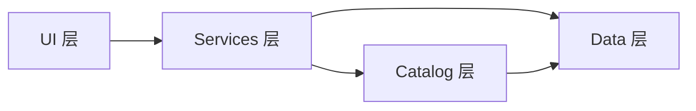

# 商店背包 · 脚本结构说明

> 工程内同步副本：`Assets/Script/StoreAndInventory/README.md`  
> 本文面向**程序 / 接主工程**时快速理解「脚本该放哪、各层能干什么」。

---

## §1 设计原则



| 原则 | 说明 |
|---|---|
| **各司其职** | 数据、服务、界面分文件夹；一个脚本只做一层的事 |
| **依赖单向** | `UI → Services → Catalog/Data`；禁止反向 |
| **Data 无 Unity UI** | `Data/` 下不出现 `UnityEngine.UI`、TMP |
| **扩展有落点** | 新功能先查 §4 对照表，再决定文件夹；不确定看 `Future/README.md` |
| **GUID 稳定** | 移动脚本必须连同 `.meta` 一起移，避免场景/Prefab 断引用 |

---

## §2 目录总览

```
StoreAndInventory/
├── Attributes/              # Inspector 特性（如 ReadOnly）
├── Common/                  # 跨模块工具（日志等）
├── Catalog/                 # 全局索引 / 注册表
├── Services/                # 运行时业务服务（MonoBehaviour）
│   ├── Inventory/
│   ├── Shop/
│   ├── Wallet/
│   ├── Equipment/
│   ├── Save/
│   └── Character/
├── Data/                    # 纯数据 & ScriptableObject 配置
│   ├── Item/
│   │   └── Definitions/     # 物品 SO 子类
│   ├── Effects/             # 道具/玩法效果配置（原 Modifiers）
│   ├── Character/
│   ├── Currency/
│   ├── Inventory/           # 背包/槽位 DTO（非 SO 子类）
│   ├── Shop/
│   └── Save/
├── UI/
│   ├── Common/              # 跨 Panel 共用
│   ├── Shop/
│   └── Inventory/
├── Test/                    # 测试场景（ItemTestController）
├── Future/                  # 预留说明，无运行时代码
└── Editor/
    ├── Setup/               # MoYuan 菜单、场景接线
    └── Inspectors/          # 自定义 Drawer
```

---

## §3 各层详解

### 3.1 Data — 配置与 DTO

**放**：ScriptableObject 定义、序列化 DTO、枚举、效果**配置**（不执行）。

| 子目录 | 典型类型 | 职责 |
|---|---|---|
| `Item/Definitions/` | `ItemBase`, `Equipment`, `Consumable`, `StoryItem` | 策划创建的资产 |
| `Item/` | `ItemStack`, `ItemEnums`, `ConsumableQueryEntry` | 物品通用数据结构 |
| `Effects/` | `GameplayEffectSO`, `StatModifier`, `SkillModifier` | 效果**数据**；执行在主工程战斗/探索 |
| `Character/` | `CharacterStatsData`, `StatDisplayUtil` | 角色属性数据与显示文案 |
| `Currency/` | `CurrencyWallet`, `CurrencyId` | 钱包 DTO |
| `Inventory/` | `InventoryData`, `EquipmentData` | 背包格、符文槽存档结构 |
| `Shop/` | `ShopTableSO`, `ShopEntry`, `ShopRuntimeData` | 商店表与运行时库存 |
| `Save/` | `ISaveBlock`, `SaveKeys`… | 存档块契约 |

> **注意**：`Data/Item/Definitions/Equipment`（符文**物品**）≠ `Data/Inventory/EquipmentData`（槽位**存档**）≠ `Services/Equipment/`（**服务**）。

### 3.2 Catalog — 索引

| 脚本 | 职责 |
|---|---|
| `ItemDatabase` | 把所有 `ItemBase` SO 注册成 `id → 定义`，供 `Inventory` / `ShopService` 查表 |

只做**查找**，不做买卖规则。

### 3.3 Services — 运行时业务

每个子文件夹对应**一个场景单例式** MonoBehaviour（Inspector 拖引用）。

| 子目录 | 脚本 | 对外能力摘要 |
|---|---|---|
| `Inventory/` | `Inventory` | 加/取/消耗、查询消耗品 |
| `Shop/` | `ShopService` | 开店/关店、买/卖、限购归档 |
| `Wallet/` | `WalletService` | Ink 增减 |
| `Equipment/` | `EquipmentService` | 装/卸符文、`GetAllStatMods` 等 |
| `Save/` | `StoreSaveService` | 存档块 JSON 捕获/还原 |
| `Character/` | `TestCharacter` | 测试用基础属性（主工程可替换） |

### 3.4 UI — 表现与输入

| 子目录 | 脚本 | 说明 |
|---|---|---|
| `Common/` | `ItemTooltipUI`, `StoreInventoryPanelController` | Tooltip、商店/背包互斥 |
| `Shop/` | `ShopUI`, `ShopItemUI`, `SellItemUI` | 商店 Buy/Sell |
| `Inventory/` | `InventoryUI`, `InventoryItemUI`, `EquipmentSlotUI`, `AttributeStatLineUI` | 背包、符文槽、属性行 |

UI 只调用 Services API，**不**直接改 `List<ItemStack>`。

### 3.5 Common / Attributes / Test / Editor

| 层 | 用途 |
|---|---|
| `Common/` | `StoreInventoryLog` 等无领域归属的工具 |
| `Attributes/` | `[ReadOnly]` 等 Inspector 特性 |
| `Test/` | `ItemTestController`（B/I、ExtQuery、SaveTest；**勿拷主工程**） |
| `Editor/Setup/` | `Setup Full Store Loop`、场景清理 |
| `Editor/Inspectors/` | `ReadOnlyDrawer` |

---

## §4 新增脚本放哪？（对照表）

| 你要写的东西 | 推荐路径 | 例子 |
|---|---|---|
| 新物品类型 SO | `Data/Item/Definitions/` | 新继承 `ItemBase` |
| 新效果配置 SO | `Data/Effects/` | 持续伤害、Buff 表 |
| 效果**执行**逻辑 | `Services/Effects/`（未来）或主工程战斗 | `ApplyEffect()` |
| 新货币 / 钱包字段 | `Data/Currency/` + `Services/Wallet/` | Spirit 实装 |
| 新商店规则 | `Services/Shop/` | 随机货架 Refresh |
| 新 UI 面板 | `UI/Shop/` 或 `UI/Inventory/` | 筛选、排序 |
| 跨 Panel 组件 | `UI/Common/` | 通用 Tooltip 变体 |
| 全局查表 | `Catalog/` | 第二个 Database |
| 存档新块 | `Data/Save/` 定义键 + `Services/Save/` 注册 | `quest.v1` |
| 测试/Debug | `Test/` 或 `Editor/` | 临时按钮 |
| 尚未立项 | 只更新 `Future/README.md` | 不占 Runtime 目录 |

---

## §5 与场景物体的对应

| 场景 GameObject | 对应脚本层 |
|---|---|
| `ItemDatabase` | Catalog |
| `Inventory` | Services/Inventory |
| `ShopService` … `StoreSaveService` | Services/* |
| `TestCharacter` | Services/Character |
| `ShopPanel` / `InventoryPanel` | UI/Shop、UI/Inventory |
| `StoreInventoryPanelController` | UI/Common |
| `TestController` | Test |

场景分组建议见 [[系统使用手册]] §5 与此前场景结构梳理。

---

## §6 程序集

| asmdef | 包含 |
|---|---|
| `StoreAndInventory.asmdef` | 除 Editor 外全部 Runtime |
| `StoreAndInventory.Editor.asmdef` | `Editor/` 下全部 |

---

## §7 维护约定

1. **移动脚本** → 必须连同 `.meta`；改完在 Unity 编译一次确认无 Missing Script。
2. **新增顶层文件夹** → 更新本文 + 工程 `README.md` + `Future/README.md`（若预留）。
3. **CreateAssetMenu** 保持 `MoYuan/...` 前缀，与策划菜单一致。
4. **大改目录** → 在 [[工程清理与优化记录]] 追加一节，并跑 [[系统功能与工程规范]] §5 验收。

---

## §8 相关文档

| 文档 | 内容 |
|---|---|
| [[系统功能与工程规范]] | 行为约束、API 边界 |
| [[系统使用手册]] | 策划/测试怎么用 |
| [[工程清理与优化记录]] | 历次重构记录 |
| `Future/README.md`（工程内） | 预留扩展落点 |
